## 1 Developing With Arduino

Makers, students & professionals have been using the classic Arduino IDE (Integrated Development Environment) ever since Arduino was born.

The Arduino IDE 2 is an improvement of the classic IDE, with increased performance, improved user interface and many new features, such as [autocompletion](https://docs.arduino.cc/software/ide-v2/tutorials/ide-v2-autocomplete-feature), a [built-in debugger](https://docs.arduino.cc/software/ide-v2/tutorials/ide-v2-debugger) and [syncing sketches with Arduino Cloud](https://docs.arduino.cc/software/ide-v2/tutorials/ide-v2-cloud-sketch-sync).

### 1.1 Downloading  and Installing Arduino IDE2

#### Downloads Arduino IDE2

download the IDE2 from the [Arduino Software page](https://www.arduino.cc/en/software).

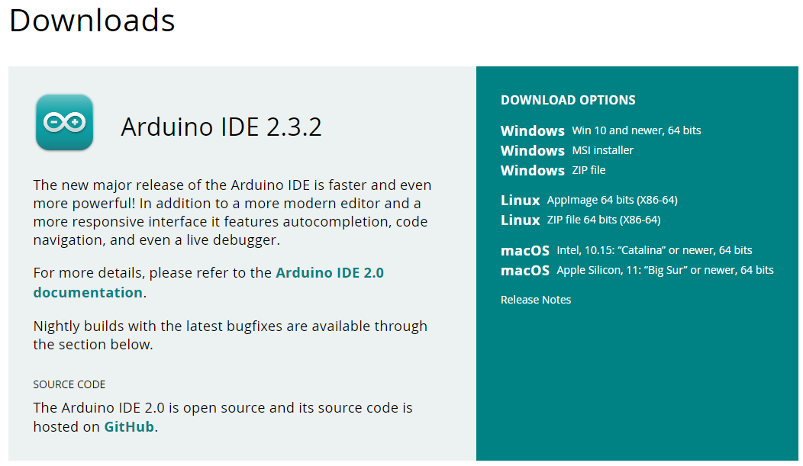

#### Installs  Arduino IDE2 (Windows)

To install the Arduino IDE2 on a Windows computer, simply run the file downloaded from the software page.

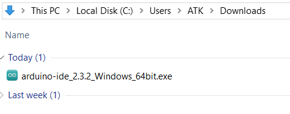

Follow the instructions in the installation guide. The installation may take several minutes.

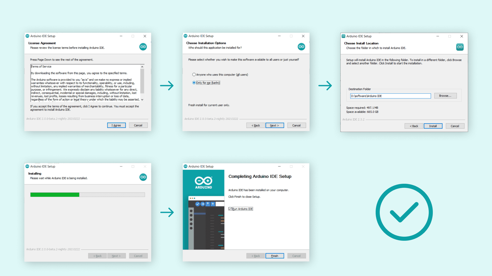

You can now use the **Arduino IDE2** on your Windows computer!

If you use the Linux computer or MacOS computer, you can follow the [downloading and installing the Arduino IDE2 tutorial](https://docs.arduino.cc/software/ide-v2/tutorials/getting-started/ide-v2-downloading-and-installing).

### 1.2 Arduino IDE2  Introduction

The Arduino IDE2 features a new sidebar, making the most commonly used tools more accessible.

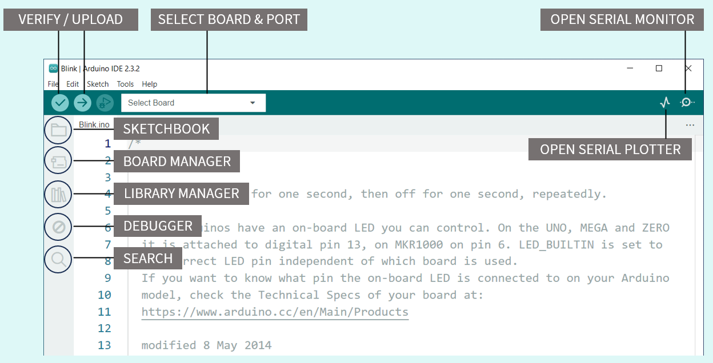

- **Verify / Upload** - compile and upload your code to your Arduino Board.

- **Select Board & Port** - detected Arduino boards automatically show up here, along with the port number.

- **Sketchbook** - here you will find all of your sketches locally stored on your computer. Additionally, you can sync with the  [Arduino Cloud](https://cloud.arduino.cc/?_gl=1*atplq1*_ga*MTY5ODQwNDEwNi4xNjk2NzU1MjQ2*_ga_NEXN8H46L5*MTcxMjAyNDkzNi41Ny4xLjE3MTIwMjU3NjYuMC4wLjE2NTI3NjE1OTU.*_fplc*T2pSVkl4S0Y3JTJCYzZNbXZZUDExJTJCbyUyQkR1bUF5ZTh3dWZZTldabTZKayUyRk1pRUVTRnZCaG9CSE85SFlUb0ElMkJ4bVQxdk1Dd2ZpV2JXOHFuVUNOQ2U5QzgzWFV5d3BJQ0hVdUVoJTJCalVoVG94aTR5U3FZS3licyUyQkNMSVdjMUNtY2clM0QlM0Q.), and also obtain your sketches from the online environment.

- **Boards Manager** - browse through Arduino & third party packages that can be installed. For example, using a MKR WiFi 1010 board requires **the Arduino SAMD Boards** package  installed.

- **Library Manager** - browse through thousands of Arduino libraries, made by Arduino & its community.

- **Debugger** - test and debug programs in real time.

- **Search** - search for keywords in your code.

- **Open Serial Monitor** - opens the Serial Monitor tool, as a new tab in the console.

The **Arduino IDE2** is a versatile editor with many features. You can install libraries directly, sync your sketches with **Arduino Cloud,** debug your sketches and much more. You can click [Arduino IDE2 Features Introduction](https://docs.arduino.cc/software/ide-v2/tutorials/getting-started-ide-v2/) to learn more.

### 1.3 Installing ESP32 Package in the IDE2

The board manager is a great tool for installing the necessary board packages to use your Arduino boards.

Simply explained, a board package is written and designed for specific microcontrollers. Arduino offers several different types of boards, and these boards may also have different types of microcontrollers. While different microcontrollers accomplish tasks in similar ways, the way code is compiled, pins are mapped, and what features are available is tailor-made to the silicon itself, meaning that this will also be microcontroller-specific.

What a board package does is to act as a layer between all of this microcontroller-specific jargon, and you - the maker. The board package translates it into the Arduino API you are already familiar with so that you can program any of the microcontrollers in the Arduino ecosystem in the same way.

In conclusion, to use a ESP32 board, we need to install a ESP32 board package.

To start the installation process using the Boards Managaer, follow these steps:

- Start Arduino and open the Preferences window.

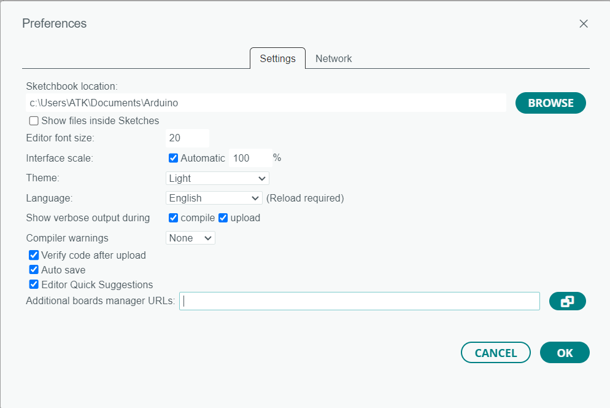

- Enter one of the release links above into Additional Board Manager URLs field. You can add multiple URLs, separating them with commas.

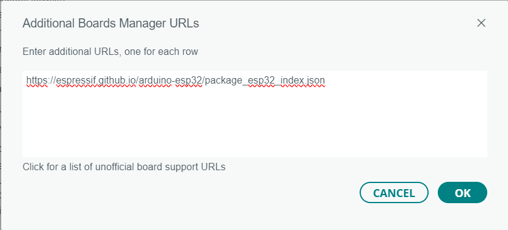

- Open Boards Manager from Tools > Board menu and install *esp32* platform (and do not forget to select your ESP32 board from Tools > Board menu after installation).

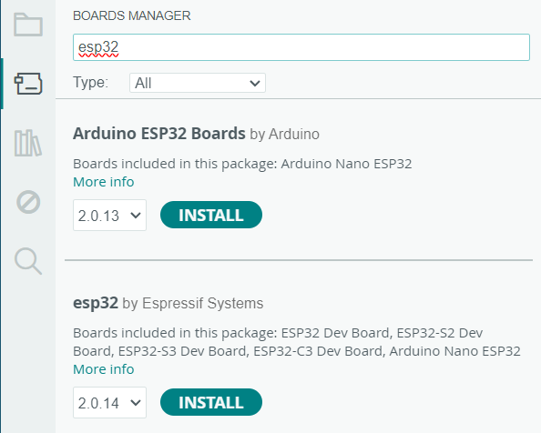

- Restart Arduino IDE2

you can click [Arduino esp32 Install](https://docs.espressif.com/projects/arduino-esp32/en/latest/installing.html#installing-using-arduino-ide) to learn more.

### 1.4 Installing libraries

A large part of the Arduino programming experience is the **use of libraries.** There are thousands of libraries that can be found online, and the best documented ones can be found and installed directly through the editor.

Through [Installing library Tutorials](https://docs.arduino.cc/software/ide-v2/tutorials/ide-v2-installing-a-library/),we will go through how to install a library using the library manager in the Arduino IDE2. 

### 1.5 uploading a sketch

In the Arduino environment, we write **sketches** that can be uploaded to Arduino boards. 

Uploading a sketch is quick and easy, but let's take a look at what we need to do.

1. Open the Arduino IDE2

2. With the editor open, let's take a look at the toolbar at the top. At the very left, there is a **checkmark** and an **arrow pointing right**. The checkmark is used to **verify**, and the arrow is used to **upload.**

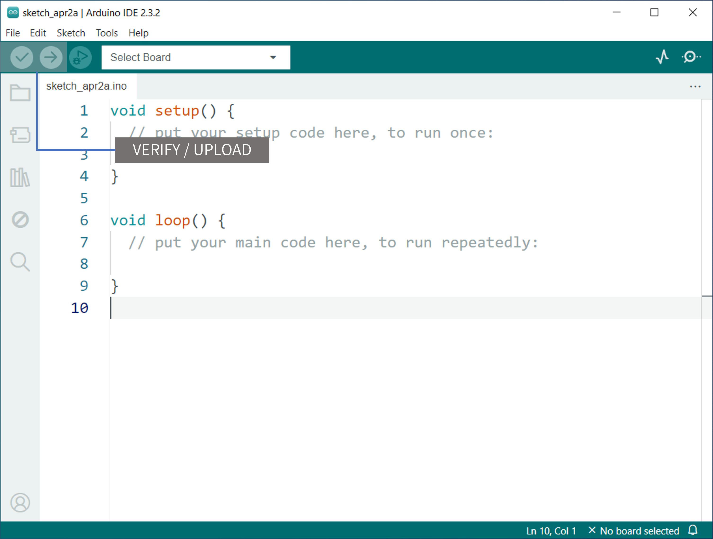

 The verify tool simply goes through your sketch, checks for errors and compiles it. The upload tool does the same, but when it finishes compiling the code, it also uploads it to the board.

3. But before doing any of that, we should choose what board we are uploading to. Beside the verify and upload button you should see a a drop down menu, this will, in most cases, display Arduino boards that are connected to your computer. If your board is not automatically detected, you can either press "Select other board and port..." in the drop-down and follow the instructions, or go to **Tools > Board** and **Tools > Port** in the toolbar menu to select the board and port manually.

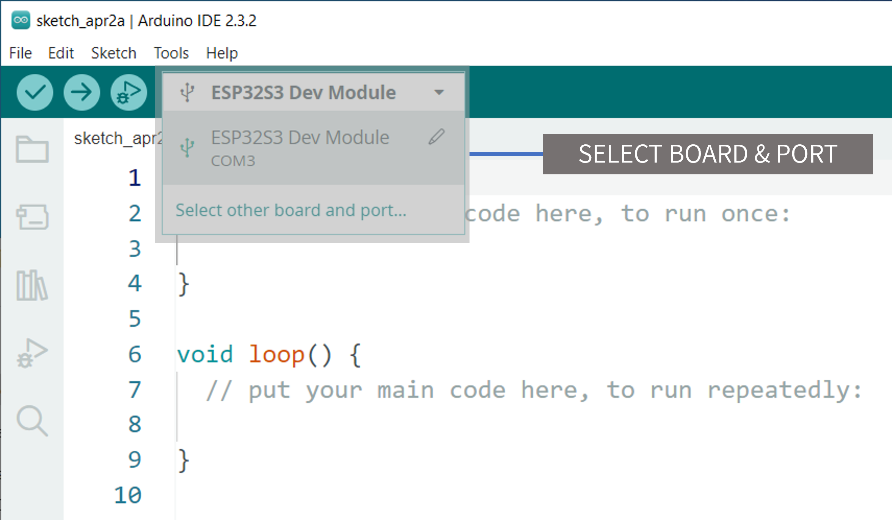

So connect your board to the computer and select it from the drop down menu. You'll know that there is a connection to the board when the board name appears in **bold**.

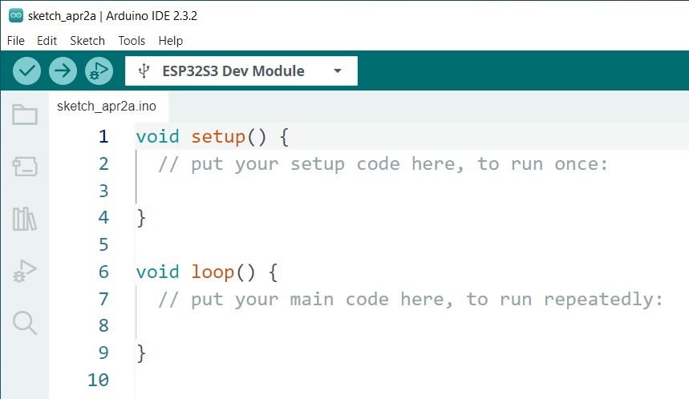

4. The ESP32 parameters need to be set so that the project code executes correctly.

	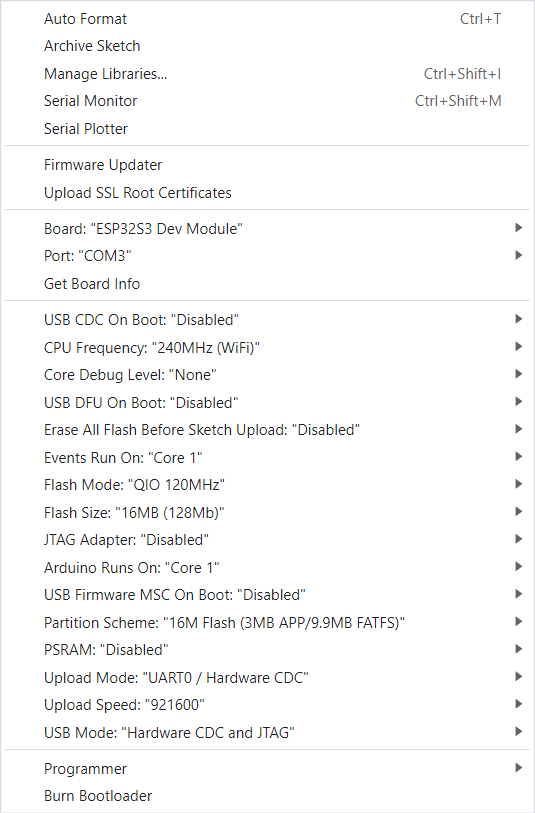

5. Click on the verify tool (checkmark). Since we are verifying an empty sketch, we can be sure it is going to compile. After a few seconds, we can see the result of the action in the console (black box in the bottom).

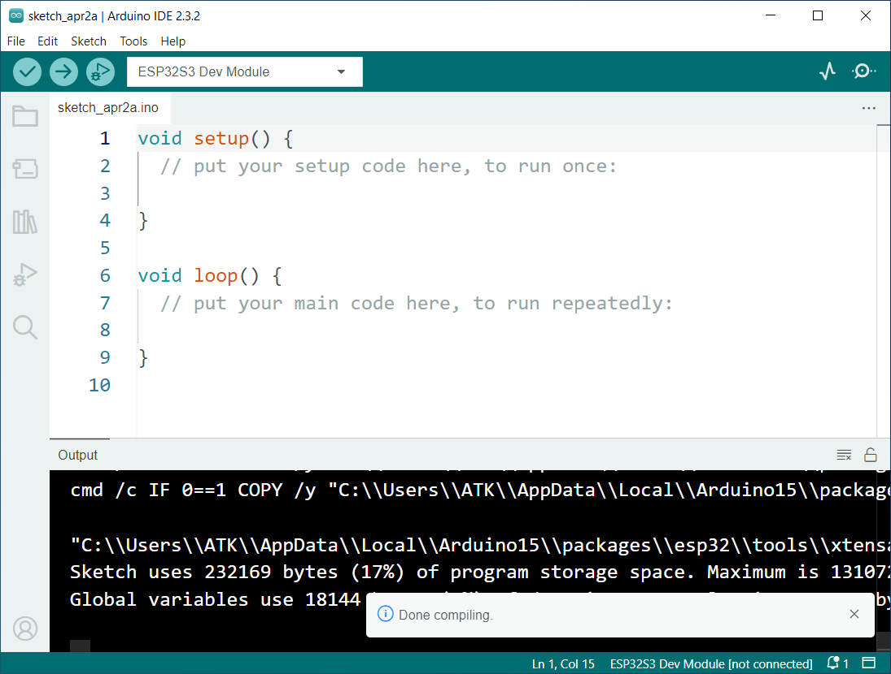

6. With the board selected, we are good to go! Click on the **upload** button, and it will start uploading the sketch to the board.

7. When it is finished, a notification pops up in the bottom right of your IDE window. Of course, sometimes there are some complications when uploading, and these errors will be listed here as well.

	

Congratulations, you have now uploaded a sketch to your Arduino board!

If you use the Linux computer or MacOS computer, you can follow the [how to upload a sketch with the Arduino IDE2 tutorial](https://docs.arduino.cc/software/ide-v2/tutorials/getting-started/ide-v2-uploading-a-sketch/).

### 1.6 Using the Serial Monitor tool

[Using the Serial Monitor tool](https://docs.arduino.cc/software/ide-v2/tutorials/ide-v2-serial-monitor/) tutorials

### 1.7 Other

[Arduino IDE Docs](https://docs.arduino.cc/software/ide/)

[jump to Homepage](#Developing With Arduino)
