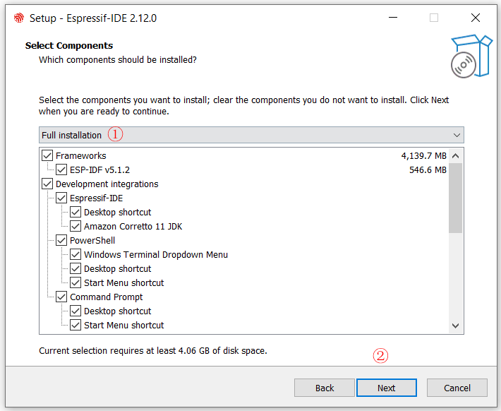

## 1 Developing With ESP-IDF

### 1.1 Installation of ESP-IDF

1.ESP-IDF Tools Installer for Windows download page: https://dl.espressif.com/dl/esp-idf/.

2.Run as Administrator.

3.Please select "`English`" as the installation language.

4.After checking the "`I acceot the agreement`" option, please click "`Next`" to continue with the installation.

5.Please click "`Apply Fixes`" and then continue to click "`Next`" to proceed with the installation process.

6.Please select the installation path and click "`Next`" to continue the installation process.

7.Please select the full installation option and click "`Next`" to continue the installation process.

8.At the end of the installation process you can check out option `Run ESP-IDF PowerShell Environment` or `Run ESP-IDF Command Prompt (cmd.exe)`. The installer launches ESP-IDF environment in selected prompt.

When the terminal prompts you to execute the "`idf. py build`" command, it indicates that your ESP-IDF environment has been successfully installed.

9.Environment Variables.

### 1.2 Installation of Visual Studio Code 

1.Download and install [Visual Studio Code](https://code.visualstudio.com/Download)

2.Run as Administrator.

3.After checking the "`I agree to this agreement`" option, please click "`Next`" to continue with the installation.

4.Please select the installation path and click "`Next`" to continue the installation process.

5.Please select the required additional tasks and click "`Next`" to continue the installation process.

6.Installation of Visual Studio Code.

### 1.3 ESP-IDF Visual Studio Code Extension

1.Open the `Extensions` view by clicking on the Extension icon in the Activity Bar on the side of Visual Studio Code or the `View: Extensions` command (shortcut: <kbd>⇧</kbd> <kbd>⌘</kbd> <kbd>X</kbd> or <kbd>Ctrl+Shift+X</kbd>).

2.Search for [ESP-IDF Extension](https://marketplace.visualstudio.com/items?itemName=espressif.esp-idf-extension).

3.Install the extension.

4.In Visual Studio Code, select menu "`View`" and "Command Palette" and type [configure esp-idf extension]. After, choose the `ESP-IDF: Configure ESP-IDF Extension` option.

5.Choose `Express` for the fastest option (or `Use Existing Setup` if ESP-IDF is already installed).

6.If you choose `Express` setup mode:

- Pick an ESP-IDF version to download (or find ESP-IDF in your system) and the python executable to create the virtual environment.
- Choose the location for ESP-IDF Tools and python virtual environment (also known as `IDF_TOOLS_PATH`) .

**NOTE:**Windows users don't need to select a python executable since it is part of the setup.

**NOTE:**Make sure that `IDF_PATH` and `IDF_TOOLS_PATH` doesn't have any spaces to avoid any build issues.

7.The user will see a page showing the setup progress status showing ESP-IDF download progress, ESP-IDF Tools download and install progress as well as the creation of a python virtual environment.

8.If everything is installed correctly, the user will see a message that all settings have been configured. You can start using the extension.

### 1.4 Tutorials

**1 How to New Project**

- [New Project Wizard](https://github.com/espressif/vscode-esp-idf-extension/blob/master/docs/tutorial/new_project_wizard.md)

**2 How to Project Configuration**

- [Partition Table Editor](https://github.com/espressif/vscode-esp-idf-extension/blob/master/docs/tutorial/partition_editor.md)
- [NVS Partition Editor](https://github.com/espressif/vscode-esp-idf-extension/blob/master/docs/tutorial/nvs_partition_editor.md)
- [CMakeLists.txt Editor](https://github.com/espressif/vscode-esp-idf-extension/blob/master/docs/tutorial/cmakelists_editor.md)

- [Basic usage](https://github.com/espressif/vscode-esp-idf-extension/blob/master/docs/tutorial/basic_use.md)
- [Code Coverage](https://github.com/espressif/vscode-esp-idf-extension/blob/master/docs/tutorial/code_coverage.md)
- [ESP-IDF Extension Features for Visual Studio Code](https://github.com/espressif/vscode-esp-idf-extension/blob/master/docs/FEATURES.md#Build)

**3 How to Debug**

- [Debug](https://github.com/espressif/vscode-esp-idf-extension/blob/master/docs/tutorial/debugging.md)
- [Configuration for Visual Studio Code Debug](https://github.com/espressif/vscode-esp-idf-extension/blob/master/docs/DEBUGGING.md)
- [Application Tracing](https://github.com/espressif/vscode-esp-idf-extension/blob/master/docs/tutorial/app_tracing.md)
- [Heap Tracing and SystemView Tracing](https://github.com/espressif/vscode-esp-idf-extension/blob/master/docs/tutorial/heap_tracing.md)
- [eFuse Explorer](https://github.com/espressif/vscode-esp-idf-extension/blob/master/docs/tutorial/efuse.md)

**4 Other**

- [Developing on Docker Container](https://github.com/espressif/vscode-esp-idf-extension/blob/master/docs/tutorial/using-docker-container.md)
- [Developing on WSL](https://github.com/espressif/vscode-esp-idf-extension/blob/master/docs/tutorial/wsl.md)
- [Open Existing ESP-IDF Project](https://github.com/espressif/vscode-esp-idf-extension/blob/master/docs/tutorial/existing_idf_project.md)
- [Using the Project Configuration](https://github.com/espressif/vscode-esp-idf-extension/blob/master/docs/tutorial/project_configuration.md) editor.
- [Using Multiple Build Configuration with the Project Configuration Editor](https://github.com/espressif/vscode-esp-idf-extension/blob/master/docs/tutorial/multiple_config.md)

## 2 Resources

- Documentation for the latest version: [ESP-IDF Programming Guide](https://docs.espressif.com/projects/esp-idf/en/latest/esp32s3/index.html).This documentation is built from the [docs directory](https://github.com/espressif/esp-idf/blob/master/docs) of this repository.
- [Beginner's Guide to Key Concepts and Resources of ESP-IDF](https://youtu.be/J8zc8mMNKtc?feature=shared)
- The [esp32.com forum](https://esp32.com/) is a place to ask questions and find community resources.
- [Check the Issues section on github](https://github.com/espressif/esp-idf/issues) if you find a bug or have a feature request. Please check existing Issues before opening a new one.
- If you're interested in contributing to ESP-IDF, please check the [Contributions Guide](https://docs.espressif.com/projects/esp-idf/en/latest/esp32s3/contribute/index.html).

