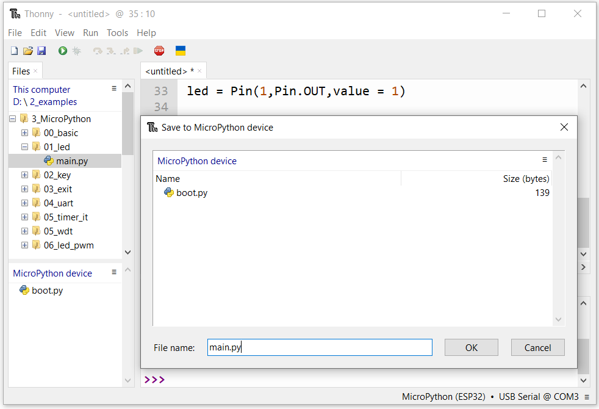
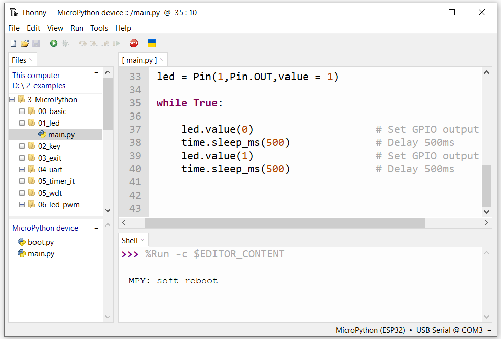

## 1 Developing With MicroPython

### 1.1 Introduction

Thonny is a free, open-source software platform with compact size, simple interface, simple operation and  rich functions, making it a Python IDE for beginners. In this tutorial, we use this IDE to develop ESP32-S3 during  the whole process.  Thonny supports various operating system, including Windows、Mac OS、Linux.

### 1.2 Downloading Thonny

1.Thonny Tools Installer for Windows download page: https://thonny.org.

Follow the instruction of official website to install Thonny or click the links below to download and install.  (Select the appropriate one based on your operating system.)


2.The icon of Thonny after downloading is as below. Double click “thonny-4.1.1.exe”.


3.If you’re not familiar with computer software installation, you can simply keep clicking “Next” until the  installation completes.


4.If you want to change Thonny’s installation path, you can click “Browse” to modify it. After selecting installation  path, click “OK”. If you do not want to change it, just click “Next”.


5.Check “Create desktop icon” and then it will generate a shortcut on your desktop to facilitate you to open  Thonny later.


6.Click “install” to install the software.


7.During the installation process, you only need to wait for the installation to complete, and you msut not click  "Cancel", otherwise Thonny will fail to be installed.


8.Once you see the interface as below, Thonny has been installed successfully.


9.If you’ve check “Create desktop icon” during the installation process, you can see the below icon on your  desktop.

### 1.3 Basic Configuration of Thonny

1.Click the desktop icon of Thonny and you can see the interface of it as follows:


**NOTE**:DNESP32S3 Board uses CH340C to download codes. So before using it, we need to install CH340C driver in our computers.

4.Connect your computer and DNESP32S3 Board with a USB cable.


5.Turn to the main interface of your computer, select “This PC” and right-click to select “Manage”.


6.Click “Device Manager”. If your computer has installed CH340, you can see“USB-SERIAL CH340 (COMx)”. And you can click here to move to the next step.


## 2 Burning Micropython Firmware

To run Python programs on ESP32-S3, we need to burn a firmware to ESP32-S3 first.

### 2.1 Downloading Micropython Firmware

Official website of microPython: http://micropython.org/ 

Webpage listing firmware of microPython for ATK-MWS3S(ESP32-S3R8): [MicroPython - Python for microcontrollers](https://micropython.org/download/ESP32_GENERIC_S3/)


Firmware used in this tutorial is ESP32_GENERIC_S3-SPIRAM_OCT-20240222-v1.22.2.bin.

### 2.2 Burning a Micropython Firmware

1.Open Thonny, click “Run” and select “Configure interpreter...”.


2.Select “Micropython (ESP32)”，select “USB-SERIAL @ COM3”，and then click “Install or update  Micropython(esptool)”


3.You can click the icon to the left of Install, then click Select local MicroPython image, and select the file we  provide.


4.Wait for the installation to be done.


5.Close all dialog boxes, turn to main interface and click “STOP”. As shown in the illustration below.


6.So far, all the preparations have been made.

## 3 Testing codes

### 3.1 Testing Shell Command

Enter "print('hello world')" in "Shell" and press Enter.


### 3.2 Running Online

ESP32-S3 needs to be connected to a computer when it is run online. Users can use Thonny to writer and debug  programs.

1.Open Thonny and click “Open…”.


2.On the newly pop-up window, click “This computer”.


3.In the new dialog box, select “01_led.py” in  “./2_examples/3_MicroPython/01_led” folder.


4.Click “Run current script” to execute the program and and you can see that LED is ON for 500ms and then OFF for 500ms, which repeats in an endless loop.


Note：When running online, if you press the reset key of ESP32-S3, user’s code will not be executed again. If you  wish to run the code automatically after resetting the code, please refer to the following [Running Offline](###3.3 Running Offline).

### 3.3 Running Offline

After ESP32-S3 is reset, it runs the file boot.py in root directory first and then runs file main.py, and finally, it  enters “Shell”. Therefore, to make ESP32-S3 execute user’s programs after resetting, we need to add a guiding  program in boot.py to execute user’s code.

1.Move the program folder “./2_examples/3_MicroPython/01_led” to disk(D) in  advance with the path of “D:/2_examples”. Open “Thonny”。


2.Expand “01_led” in the “2_examples/MicroPython” in the directory of disk(D), and double-click main.py,  which is provided by us to enable programs in “MicroPython device” to run offline.


If you want your written programs to run offline, you need to upload boot.py we provided and all your  codes to “MicroPython device” and press ESP32-S3’s reset key. Here we use programs 00.and 01 as  examples. Select “main.py”, right-click to select “Upload to /”.


3.Press the reset key and in the box of the illustration below, you can see the code is executed.


Note: To exit Offline mode, press ctrl + C in the Shell at the same time.

## 4 Thonny Common Operation

### 4.1 Downloading Code to Computer

Select “boot.py” in “MicroPython device”, right-click to select “Download to ...” to download the code to your  computer.


### 4.2 Deleting Files from ESP32-S3’s Root Directory

Select “boot.py” in “MicroPython device”, right-click it and select “Delete” to delete “boot.py” from ESP32’s  root directory.


### 4.3 Deleting Files from your Computer Directory

Select “main.py” in “01_led”, right-click it and select “Move to Recycle Bin” to delete it from “01_led”.


### 4.4 Creating and Saving the code

1.Click “File”->“New” to create and write codes.


2.Enter codes in the newly opened file. Here we use codes of “01_led.py” as an example.


3.Click “Save” on the menu bar. You can save the codes either to your computer or to ATK-MWS3S(ESP32-S3-WROOM).Select “MicroPython device”, enter “main.py” in the newly pop-up window and click “OK”.




5.You can see that codes have been uploaded to ATK-MWS3S(ESP32-S3-WROOM).



6.Disconnect and reconnect USB cable, and you can see that LED is ON for 500ms and then OFF for 500ms, which repeats in an endless loop.

## 5 Building the firmware

Building the firmware page:[micropython/ports/esp32 at master · micropython/micropython (github.com)](https://github.com/micropython/micropython/tree/master/ports/esp32)

## 6 MicroPython external C modules

MicroPython external C modules page:[MicroPython external C modules — MicroPython latest documentation](https://docs.micropython.org/en/latest/develop/cmodules.html).

1.Create a new folder called BSP in the directory of microsython \ examples \ usercmodule. Next, copy all the files in the 2ueexamples \ 3-MicroPython \ CModules-Lib directory to the newly created BSP folder. After completing these steps, you need to edit the microsython.cmake file in the microsython \ examples \ usercmodule directory. The specific modifications are as follows.

```python
# This top-level micropython.cmake is responsible for listing
# the individual modules we want to include.
# Paths are absolute, and ${CMAKE_CURRENT_LIST_DIR} can be
# used to prefix subdirectories.

# Add the C example.
#include(${CMAKE_CURRENT_LIST_DIR}/cexample/micropython.cmake)

# Add the CPP example.
#include(${CMAKE_CURRENT_LIST_DIR}/cppexample/micropython.cmake)

# Add the IIC example.
include(${CMAKE_CURRENT_LIST_DIR}/BSP/IIC/micropython.cmake)

# Add the CAMERA example.
include(${CMAKE_CURRENT_LIST_DIR}/BSP/CAMERA/micropython.cmake)

# Add the LCD example.
#include(${CMAKE_CURRENT_LIST_DIR}/BSP/LCD/micropython.cmake)

# Add the ESP-WHO example.
include(${CMAKE_CURRENT_LIST_DIR}/BSP/ESP-WHO/micropython.cmake)

# Add the SENSOR example.
include(${CMAKE_CURRENT_LIST_DIR}/BSP/SENSOR/micropython.cmake)

# Add the RGBLCD example.
include(${CMAKE_CURRENT_LIST_DIR}/BSP/RGBLCD/micropython.cmake)
```

2.Open Windows Subsystem for Linux (WSL). Subsequently, navigate to the path micropython\ports\esp32 in WSL. Under this path, enter the corresponding command to build the firmware and ensure that the C module is integrated into the firmware. In this way, you can successfully build the MicroPython ESP32-S3 firmware that includes the required C modules.

```python
“make USER_C_MODULES=~/micropython/examples/usercmodule/micr
opython.cmake BOARD=ESP32_GENERIC_S3 BOARD_VARIANT=SPIRAM_OCT
```

Note:Our company provides self compiled firmware that is compatible with development board modules, which is stored in the folder "3_firmware\2MicroPython Firmware". Among them, the firmware "ATK-ESP32uS3_8Mpsram (with AI) -2024-01-09. bin" specifically integrates the ESP-WHO C module, while the firmware "ATK-ESP32uS3_8Mpsram -2024-01-09. bin" does not include this module. You can choose to download the corresponding firmware version as needed.

## 7 Resources

- Open-source code repositories of Thonny: https://github.com/thonny/thonny
- See the [online documentation](https://docs.micropython.org/) for API references and information about using MicroPython and information about how it is implemented.

