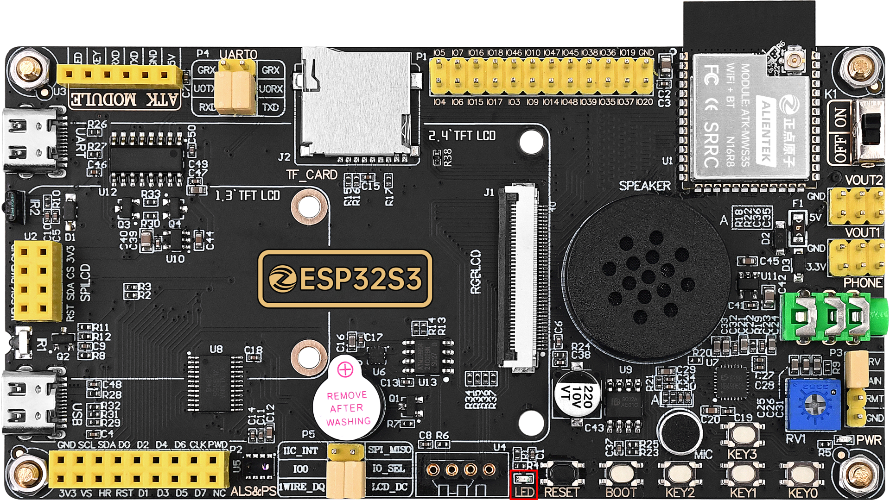

## led example

### 1 Brief

The main function of this code is to let the onboard LED blink alternately at a frequency of 500 milliseconds.

### 2 Hardware Hookup

The hardware resources used in this experiment are:

- LED - IO1

The position of the LED in the development board is shown as follows:

### 3 Running

#### 3.1 Compile & Download

There are two ways to download code for ESP32S3.

##### 3.1.1 USB UART

.png)

**1 Compilation process**

- Connect the USB UART to the computer using a USB cable
- Using VS Code to open the 01_led example
- Select UART port number(Figure ①:ESP-IDF: Select Port to Use (COM, tty, usbserial))
- Set Engineering Target Chip(Figure ②:ESP-IDF: Set Espressif Device Target)
- Clearing project engineering(Figure ③:ESP IDF: Full Clean)
- Select Flash Method(Figure ⑤:ESP-IDF: Select Flash Method)
- Build Project(Figure ④:ESP-IDF: Build Project)

**2 Download process**

- Download(Figure ⑥:ESP-IDF: Flash Device)

##### 3.1.2 JTAG(USB)

.png)

**1 Compilation process**

- Connect the TATG(USB) to the computer using a USB cable
- Using VS Code to open the 01_led example
- Select JTAG port number(Figure ①:ESP-IDF: Select Port to Use (COM, tty, usbserial))
- Clearing project engineering(Figure ③:ESP IDF: Full Clean)
- Select Flash Method(Figure ⑤:ESP-IDF: Select Flash Method)
- Build Project(Figure ④:ESP-IDF: Build Project)

**2 Download process**

- Download(Figure ⑥:ESP-IDF: Flash Device)

#### 3.2 Phenomenon

After normal operation, the red LED will blink periodically.

