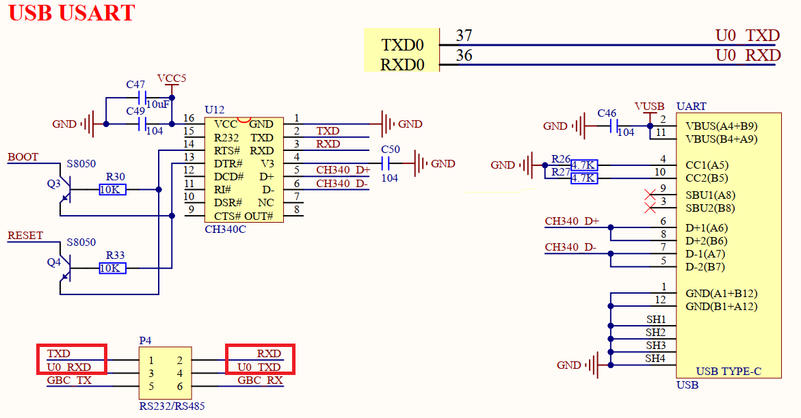

## uart example

### 1 Brief

The main function of this code is that ESP32S3 talks with the host computer through UART0, and ESP32S3 will return to the host computer after receiving the string sent by the host computer. At regular intervals, the serial port sends a message to the computer.

### 2 Hardware Hookup

The hardware resources used in this experiment are:

UART0

- TXD0 - IO43

- RXD0 - IO44

Note The pins U0_TXD and U0_RXD of the serial port are connected to the RXD and TXD pins of the serial port chip through jumper caps.

### 3 Running

#### 3.1 Compilation and Download

There are two ways to download code for ESP32S3.

##### 3.1.1 USB UART

.png)

**1 Compilation process**

- Connect the USB UART on the DNESP32S3 development board to your computer using a USB data cable
- Open the '04_uart' example using VS Code
- Select UART port number(Figure ①:ESP-IDF: Select Port to Use (COM, tty, usbserial))
- Set Engineering Target Chip(Figure ②:ESP-IDF: Set Espressif Device Target)
- Clearing project engineering(Figure ③:ESP IDF: Full Clean)
- Select Flash Method(Figure ⑤:ESP-IDF: Select Flash Method)
- Build Project(Figure ④:ESP-IDF: Build Project)

**2 Download process**

- Download(Figure ⑥:ESP-IDF: Flash Device)

##### 3.1.2 JTAG(USB)

.png)

**1 Compilation process**

- Connect the USB(JTAG) on the DNESP32S3 development board to your computer using a USB data cable
- Open the '04_uart' example using VS Code
- Select JTAG port number(Figure ①:ESP-IDF: Select Port to Use (COM, tty, usbserial))
- Clearing project engineering(Figure ③:ESP IDF: Full Clean)
- Select Flash Method(Figure ⑤:ESP-IDF: Select Flash Method)
- Build Project(Figure ④:ESP-IDF: Build Project)

**2 Download process**

- Download(Figure ⑥:ESP-IDF: Flash Device)

#### 3.2 Phenomenon

After normal operation, the serial port is opened, the serial port debugging Assistant displays a prompt message.
