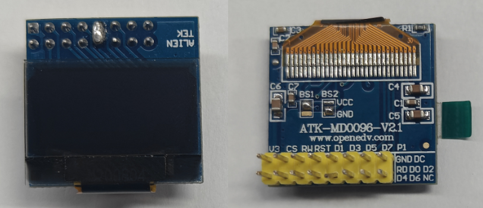
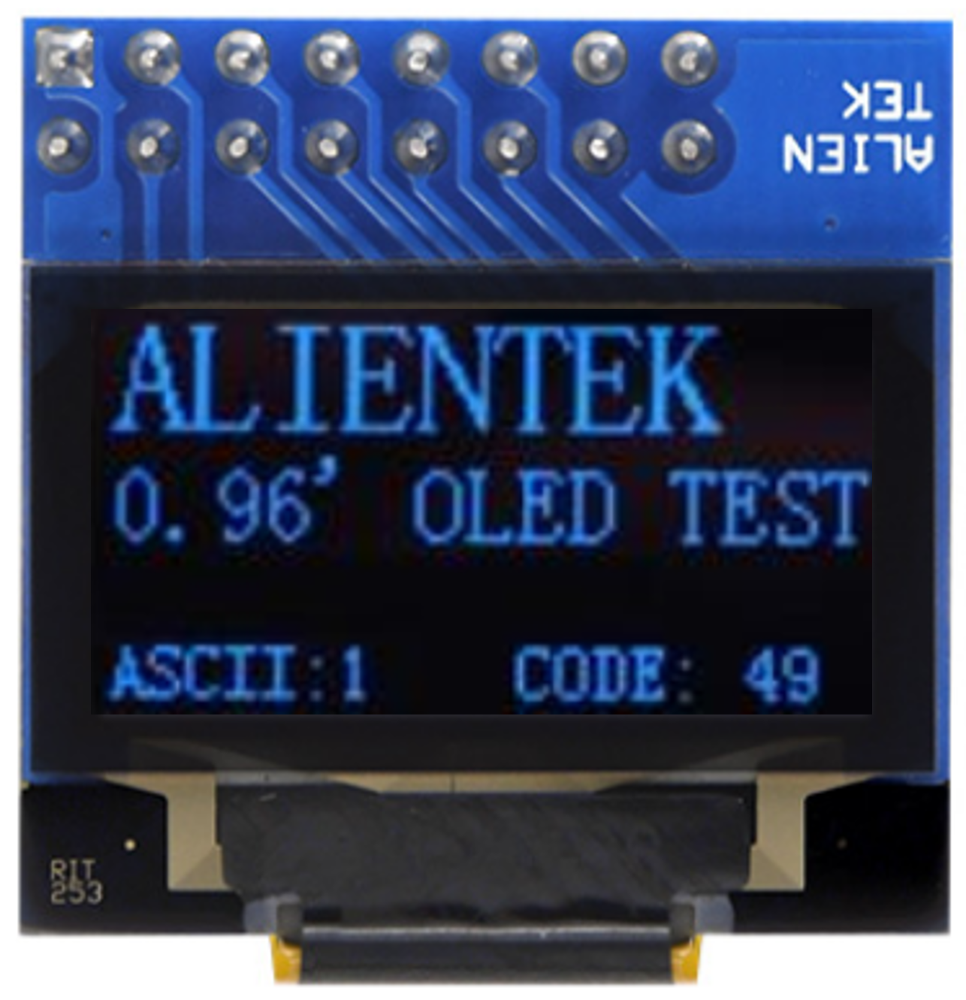

## iic_oled example

**Note:** ALIENTEK's OLED Module module supports four types of interfaces, which can be configured via the BS1 and BS2 settings on the back of the module.The default setting for ALIENTEK's OLED Module is: BS1 and BS2 connected to VCC, which means it's using the 8080 parallel interface mode. 

For this experiment, the interface mode of the OLED module needs to be changed to I2C. Therefore, you should connect BS2 to GND and connect D1 and D2 together.

### 1 Brief

The main function of this code is to use a oled module to display experimental information.

### 2 Hardware Hookup

The hardware resources used in this experiment are:

- UART0

  - TXD0 - IO43
  - RXD0 - IO44
- XL9555
  - IIC_SCL - IO42
  - IIC_SDA - IO41
  - IIC_INT - IO0(jumper cap connection)
- OLED
  - D0(SCL) - IO40
  - D1(SDA) - IO41
  - D2 - IO6
  - DC - IO38

The place position of the OLED module in the development board is shown as follows:

### 3 Running

#### 3.1 Compilation and Download

There are two ways to download code for ESP32S3.

##### 3.1.1 USB UART

.png)

**1 Compilation process**

- Connect the USB UART on the DNESP32S3 development board to your computer using a USB data cable
- Open the '11_oled' example using VS Code
- Select UART port number(Figure ①:ESP-IDF: Select Port to Use (COM, tty, usbserial))
- Set Engineering Target Chip(Figure ②:ESP-IDF: Set Espressif Device Target)
- Clearing project engineering(Figure ③:ESP IDF: Full Clean)
- Select Flash Method(Figure ⑤:ESP-IDF: Select Flash Method)
- Build Project(Figure ④:ESP-IDF: Build Project)

**2 Download process**

- Download(Figure ⑥:ESP-IDF: Flash Device)

##### 3.1.2 JTAG(USB)

.png)

**1 Compilation process**

- Connect the USB(JTAG) on the DNESP32S3 development board to your computer using a USB data cable
- Open the '11_oled' example using VS Code
- Select JTAG port number(Figure ①:ESP-IDF: Select Port to Use (COM, tty, usbserial))
- Clearing project engineering(Figure ③:ESP IDF: Full Clean)
- Select Flash Method(Figure ⑤:ESP-IDF: Select Flash Method)
- Build Project(Figure ④:ESP-IDF: Build Project)

**2 Download process**

- Download(Figure ⑥:ESP-IDF: Flash Device)

#### 3.2 Phenomenon

After normal operation, the oled module will display experimental demo.

