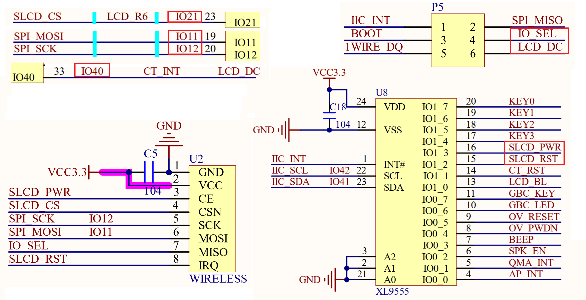
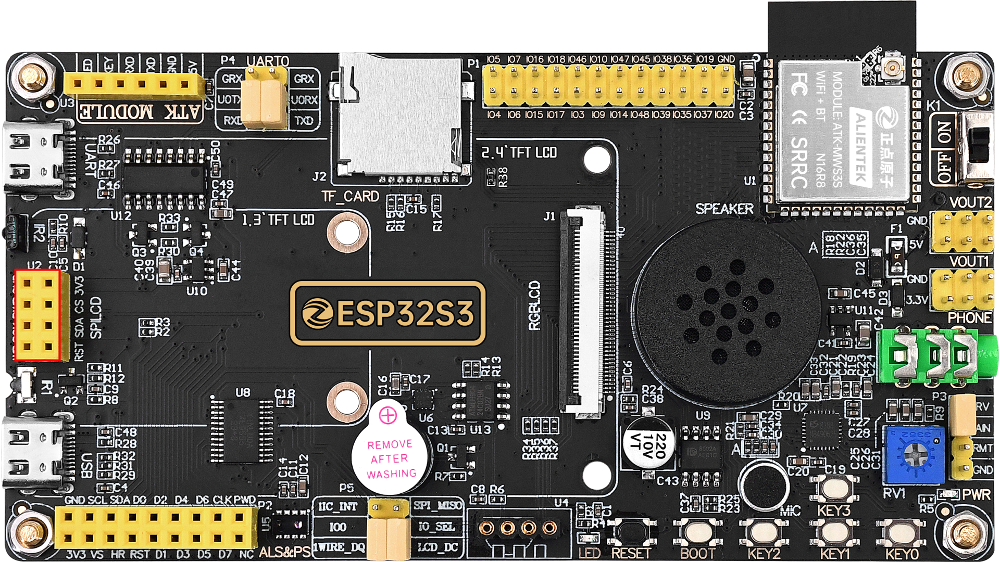

## spi_lcd example

### 1 Brief

The main function of this code is to use a 1.3 or 2.4 inch screen to display experimental information.

### 2 Hardware Hookup

The hardware resources used in this experiment are:

- UART0

  - TXD0 - IO43
  - RXD0 - IO44
- XL9555
  - IIC_SCL - IO42
  - IIC_SDA - IO41
  - IIC_INT - IO0(jumper cap connection)
- SPI_LCD
  - CS - IO21
  - SCK - IO12
  - SDA - IO11
  - DC - IO40(jumper cap connection)
  - PWR - XL9555_P13
  - RST - XL9555_P12

The place position of the SPILCD in the development board is shown as follows:

### 3 Running

#### 3.1 Compilation and Download

There are two ways to download code for ESP32S3.

##### 3.1.1 USB UART

.png)

**1 Compilation process**

- Connect the USB UART on the DNESP32S3 development board to your computer using a USB data cable
- Open the '12_spilcd' example using VS Code
- Select UART port number(Figure ①:ESP-IDF: Select Port to Use (COM, tty, usbserial))
- Set Engineering Target Chip(Figure ②:ESP-IDF: Set Espressif Device Target)
- Clearing project engineering(Figure ③:ESP IDF: Full Clean)
- Select Flash Method(Figure ⑤:ESP-IDF: Select Flash Method)
- Build Project(Figure ④:ESP-IDF: Build Project)

**2 Download process**

- Download(Figure ⑥:ESP-IDF: Flash Device)

##### 3.1.2 JTAG(USB)

.png)

**1 Compilation process**

- Connect the USB(JTAG) on the DNESP32S3 development board to your computer using a USB data cable
- Open the '12_spilcd' example using VS Code
- Select JTAG port number(Figure ①:ESP-IDF: Select Port to Use (COM, tty, usbserial))
- Clearing project engineering(Figure ③:ESP IDF: Full Clean)
- Select Flash Method(Figure ⑤:ESP-IDF: Select Flash Method)
- Build Project(Figure ④:ESP-IDF: Build Project)

**2 Download process**

- Download(Figure ⑥:ESP-IDF: Flash Device)

#### 3.2 Phenomenon

The SPILCD screen refreshes colors.

