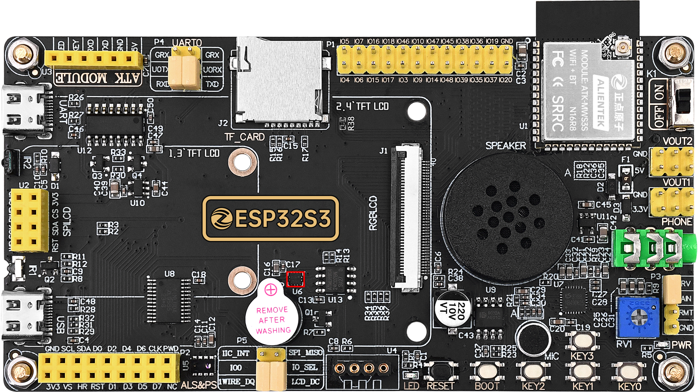

## qma6100p example

### 1 Brief

The main function of this code is to learn the triaxial accelerometer.

### 2 Hardware Hookup

The hardware resources used in this experiment are:

- UART0

  - TXD0 - IO43
  - RXD0 - IO44
- XL9555
  - IIC_SCL - IO42
  - IIC_SDA - IO41
  - IIC_INT - IO0(jumper cap connection)
- SPI_LCD
  - CS - IO21
  - SCK - IO12
  - SDA - IO11
  - DC - IO40(jumper cap connection)
  - PWR - XL9555_P13
  - RST - XL9555_P12
- QMA6100P
  - SCK - IO40
  - SDA - IO41
  - INT - XL9555_P01

The position of the qma6100p in the development board is shown as follows:

### 3 Running

#### 3.1 Compile & Download

There are two ways to download code for ESP32S3.

##### 3.1.1 USB UART

.png)

**1 Compilation process**

- Connect the USB UART to the computer using a USB cable
- Using VS Code to open the 22_qma6100p example
- Select UART port number (Figure ①:ESP-IDF: Select Port to Use (COM, tty, usbserial))
- Set Engineering Target Chip (Figure ②:ESP-IDF: Set Espressif Device Target)
- Clearing project engineering（Figure ③:ESP IDF: Full Clean）
- Select Flash Method (Figure ⑤:ESP-IDF: Select Flash Method)
- Build Project (Figure ④:ESP-IDF: Build Project)

**2 Download process**

- Download(Figure ⑥:ESP-IDF: Flash Device)

##### 3.1.2 JTAG(USB)

.png)

**1 Compilation process**

- Connect the TATG(USB) to the computer using a USB cable
- Using VS Code to open the 22_qma6100p example
- Select JTAG port number(Figure ①:ESP-IDF: Select Port to Use (COM, tty, usbserial))
- Clearing project engineering(Figure ③:ESP IDF: Full Clean)
- Select Flash Method(Figure ⑤:ESP-IDF: Select Flash Method)
- Build Project(Figure ④:ESP-IDF: Build Project)

**2 Download process**

- Download(Figure ⑥:ESP-IDF: Flash Device)

#### 3.2 Phenomenon

After normal operation, the LCD displays the pitch and roll data of the three-axis acceleration sensor.

