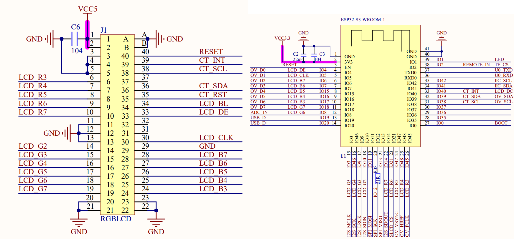
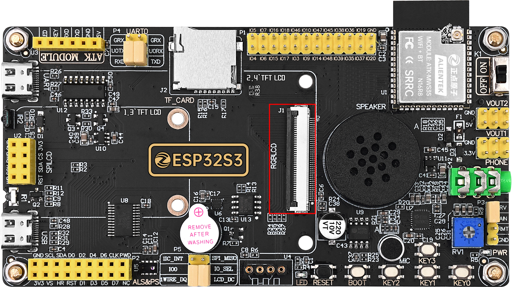
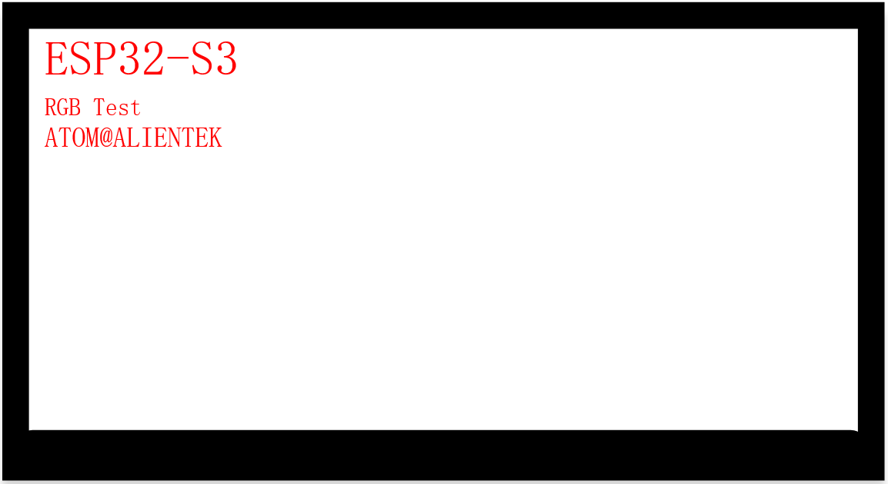

## rgb example

### 1 Brief

The main function of this code is to learn the rgblcd.

### 2 Hardware Hookup

The hardware resources used in this experiment are:

- UART0

  - TXD0 - IO43
  - RXD0 - IO44
- XL9555
  - IIC_SCL - IO42
  - IIC_SDA - IO41
  - IIC_INT - IO0(jumper cap connection)
- RGB
  - LCD_BL- XL9555_P13
  - LCD_DE - IO4
  - LCD_VSYNC - NC
  - LCD_HSYNC - NC
  - LCD_PCLK - IO5
  - LCD_R3 - IO45
  - LCD_R4 - IO48
  - LCD_R5 - IO47
  - LCD_R6 - IO21
  - LCD_R7 - IO14
  - LCD_G2 - IO10
  - LCD_G3 - IO9
  - LCD_G4 - IO46
  - LCD_G5 - IO3
  - LCD_G6 - IO8
  - LCD_G7 - IO18
  - LCD_B3 - IO17
  - LCD_B4 - IO16
  - LCD_B5 - IO15
  - LCD_B6 - IO7
  - LCD_B7 - IO6

The position of the qma6100p in the development board is shown as follows:

### 3 Running

#### 3.1 Compilation and Download

There are two ways to download code for ESP32S3.

##### 3.1.1 USB UART

.png)

**1 Compilation process**

- Connect the USB UART on the DNESP32S3 development board to your computer using a USB data cable
- Open the '23_rgb' example using VS Code
- Select UART port number (Figure ①:ESP-IDF: Select Port to Use (COM, tty, usbserial))
- Set Engineering Target Chip (Figure ②:ESP-IDF: Set Espressif Device Target)
- Clearing project engineering（Figure ③:ESP IDF: Full Clean）
- Select Flash Method (Figure ⑤:ESP-IDF: Select Flash Method)
- Build Project (Figure ④:ESP-IDF: Build Project)

**2 Download process**

- Download(Figure ⑥:ESP-IDF: Flash Device)

##### 3.1.2 JTAG(USB)

.png)

**1 Compilation process**

- Connect the USB(JTAG) on the DNESP32S3 development board to your computer using a USB data cable
- Open the '23_rgb' example using VS Code
- Select JTAG port number(Figure ①:ESP-IDF: Select Port to Use (COM, tty, usbserial))
- Clearing project engineering(Figure ③:ESP IDF: Full Clean)
- Select Flash Method(Figure ⑤:ESP-IDF: Select Flash Method)
- Build Project(Figure ④:ESP-IDF: Build Project)

**2 Download process**

- Download(Figure ⑥:ESP-IDF: Flash Device)

#### 3.2 Phenomenon

RGBLCD screen refreshes with different colors.

