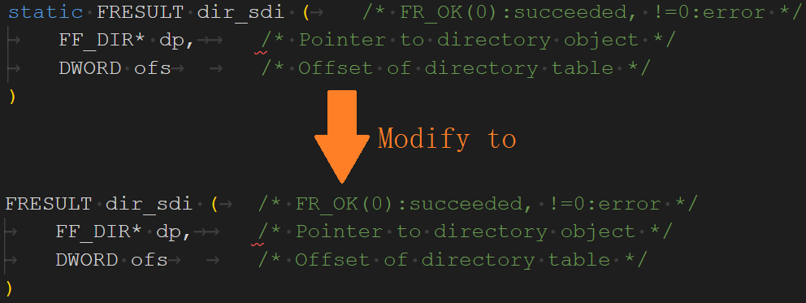
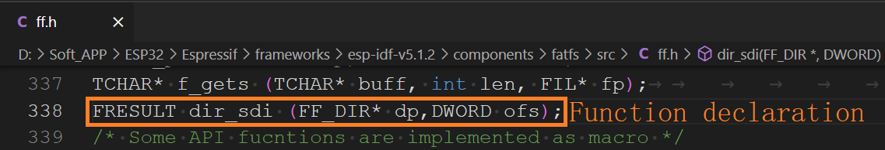

## pitures example

### 1 Considerations

In this example, we need to utilize the `dir_sdi()` function from the `ff.c` file. Since this function is defined as `static` within the ESP-IDF framework, it is inherently restricted to being called only within the `ff.c` file and cannot be directly accessed from external files. To enable the invocation of the `dir_sdi()` function from external files, we removed its `static` modifier and added a function declaration in the `ff.h` header file. This adjustment allows the function to be appropriately accessed from external files. It is worth noting that we placed this function declaration on line 338 of the `ff.h` file. We recommend readers to also declare it on or near this line to maintain consistency and readability of the code.

- **ff.c file**

- **ff.h file**

### 2 Brief

learning JPEG, PNG, BMP, and GIF decoding.

### 3 Hardware Hookup

The hardware resources used in this experiment are:

- LED - IO1
- UART0
  - TXD0 - IO43
  - RXD0 - IO44
- XL9555
  - IIC_SCL - IO42
  - IIC_SDA - IO41
  - IIC_INT - IO0(jumper cap connection)
- SPI_LCD
  - CS - IO21
  - SCK - IO12
  - SDA - IO11
  - DC - IO40(jumper cap connection)
  - PWR - XL9555_P13
  - RST - XL9555_P12
- SD
  - SDCS - IO2
  - SCK - IO12
  - MOSI - IO11
  - MISO - IO13

The hardware is consistent with the **sd example**, and will not be described in detail here.

**Note:** Please copy the entire "PICTURE" folder located in the path "2_examples/4_SD_card_mootdirectory_file" to the root directory of the SD card.

### 4 Running

#### 4.1 Compilation and Download

There are two ways to download code for ESP32S3.

##### 4.1.1 USB UART

.png)

**1 Compilation process**

- Connect the USB UART on the DNESP32S3 development board to your computer using a USB data cable
- Open the '29_pitures' example using VS Code
- Select UART port number (Figure ①:ESP-IDF: Select Port to Use (COM, tty, usbserial))
- Set Engineering Target Chip (Figure ②:ESP-IDF: Set Espressif Device Target)
- Clearing project engineering(Figure ③:ESP IDF: Full Clean)
- Select Flash Method (Figure ⑤:ESP-IDF: Select Flash Method)
- Build Project (Figure ④:ESP-IDF: Build Project)

**2 Download process**

- Download(Figure ⑥:ESP-IDF: Flash Device)

##### 4.1.2 JTAG(USB)

.png)

**1 Compilation process**

- Connect the USB(JTAG) on the DNESP32S3 development board to your computer using a USB data cable
- Open the '29_pitures' example using VS Code
- Select JTAG port number(Figure ①:ESP-IDF: Select Port to Use (COM, tty, usbserial))
- Clearing project engineering(Figure ③:ESP IDF: Full Clean)
- Select Flash Method(Figure ⑤:ESP-IDF: Select Flash Method)
- Build Project(Figure ④:ESP-IDF: Build Project)

**2 Download process**

- Download(Figure ⑥:ESP-IDF: Flash Device)

#### 4.2 Phenomenon

When no button is pressed, the system will automatically play the image. To switch between images, press KEY2 to browse the previous one, and press KEY0 to browse the next one. 

