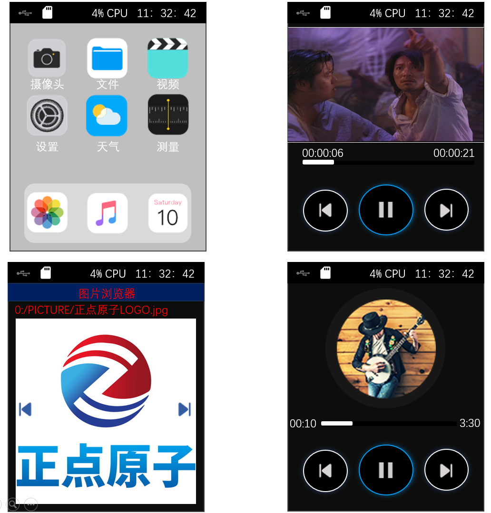

## bootloader example

### 1 Brief

The comprehensive example code for DNESP32S3 development board.

### 2 Hardware Hookup

The hardware resources used in this experiment are:

- UART0

  - TXD0 - IO43
  - RXD0 - IO44
- XL9555
  - IIC_SCL - IO42
  - IIC_SDA - IO41
  - IIC_INT - IO0(jumper cap connection)
- SPI_LCD
  - CS - IO21
  - SCK - IO12
  - SDA - IO11
  - DC - IO40(jumper cap connection)
  - PWR - XL9555_P13
  - RST - XL9555_P12

- USB

  - D- - IO19
  - D+ - IO20

- SD
  - SDCS - IO2
  - SCK - IO12
  - MOSI - IO11
  - MISO - IO13

- LED - IO1

- KEY - IO0

- EEPROM
  - IIC_SCL - IO42
  - IIC_SDA - IO41

- AP3216C
  - SCK - IO40
  - SDA - IO41
  - INT - XL9555_P00

- REMOTE_IN - IO2
- REMOTE_OUT - IO8(jumper cap connection)

- QMA6100P
  - SCK - IO40
  - SDA - IO41
  - INT - XL9555_P01

- CAMERA
  - OV_D0 - IO4
  - OV_D1 - IO5
  - OV_D2 - IO6
  - OV_D3 - IO7
  - OV_D4 - IO15
  - OV_D5 - IO16
  - OV_D6 - IO17
  - OV_D7 - IO18
  - OV_VSYNC - IO47
  - OV_HREF - IO48
  - OV_PCLK - IO45
  - OV_SCL - IO38
  - OV_SDA - IO39
  - OV_PWDN - XL9555_P4
  - OV_RESET - XL9555_P5

### 3 Running

#### 3.1 Compilation and Download

There are two ways to download code for ESP32S3.

##### 3.1.1 USB UART

.png)

**1 Compilation process**

- Connect the USB UART on the DNESP32S3 development board to your computer using a USB data cable
- Open the '36_bootloader' example using VS Code
- Select UART port number (Figure ①:ESP-IDF: Select Port to Use (COM, tty, usbserial))
- Set Engineering Target Chip (Figure ②:ESP-IDF: Set Espressif Device Target)
- Clearing project engineering（Figure ③:ESP IDF: Full Clean）
- Select Flash Method (Figure ⑤:ESP-IDF: Select Flash Method)
- Build Project (Figure ④:ESP-IDF: Build Project)

**2 Download process**

- Download(Figure ⑥:ESP-IDF: Flash Device)

##### 3.1.2 JTAG(USB)

.png)

**1 Compilation process**

- Connect the USB(JTAG) on the DNESP32S3 development board to your computer using a USB data cable
- Open the '36_bootloader' example using VS Code
- Select JTAG port number(Figure ①:ESP-IDF: Select Port to Use (COM, tty, usbserial))
- Clearing project engineering(Figure ③:ESP IDF: Full Clean)
- Select Flash Method(Figure ⑤:ESP-IDF: Select Flash Method)
- Build Project(Figure ④:ESP-IDF: Build Project)

**2 Download process**

- Download(Figure ⑥:ESP-IDF: Flash Device)

#### 3.2 Phenomenon

After system reset, it will automatically enter the main interface. At this point, users can select the desired APP by pressing the KEY0 and KEY2 buttons. Meanwhile, the KEY3 and KEY1 buttons are used to control the entry and exit operations of the APP. This design enables users to easily manage and switch between different applications.

