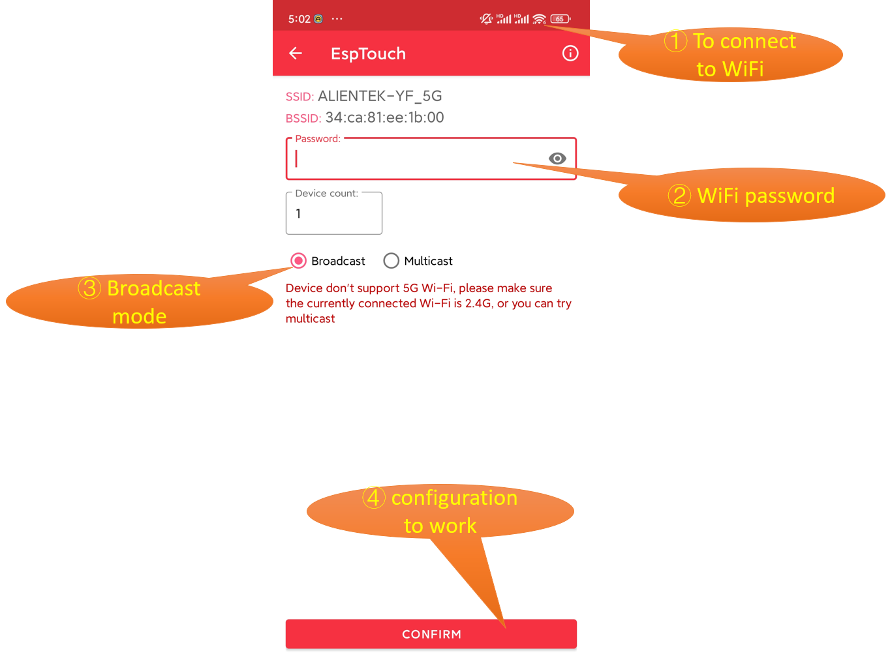

## wifi smartconfig example

### 1 Brief

Learn about one-click network configuration.

### 2 Hardware Hookup

The hardware resources used in this experiment are:

- LED - IO1

- LCD - ALIENTEK 1.3 or 2.4 inch screen
  - CS - IO21
  - SCK - IO12
  - SDA - IO11
  - DC - IO40(jumper cap connection)
  - PWR - XL9555_P13
  - RST - XL9555_P12

- XL9555
  - IIC_SCL - IO42
  - IIC_SDA - IO41
  - IIC_INT - IO0(jumper cap connection)

The WiFi is an internal peripheral, so there is no corresponding connection schematic diagram.

### 3 Running

#### 3.1 Compile & Download

There are two ways to download code for ESP32S3.

##### 3.1.1 USB UART

.png)

**1 Compilation process**

- Connect the USB UART to the computer using a USB cable
- Using VS Code to open the 04_WiFi_SmartConfig example
- Select UART port number (Figure ①:ESP-IDF: Select Port to Use (COM, tty, usbserial))
- Set Engineering Target Chip (Figure ②:ESP-IDF: Set Espressif Device Target)
- Clearing project engineering（Figure ③:ESP IDF: Full Clean）
- Select Flash Method (Figure ⑤:ESP-IDF: Select Flash Method)
- Build Project (Figure ④:ESP-IDF: Build Project)

**2 Download process**

- Download（Figure ⑥:ESP-IDF: Flash Device）

##### 3.1.2 JTAG(USB)

.png)

**1 Compilation process**

- Connect the TATG(USB) to the computer using a USB cable
- Using VS Code to open the 04_WiFi_SmartConfig example
- Select JTAG port number (Figure ①:ESP-IDF: Select Port to Use (COM, tty, usbserial))
- Clearing project engineering（Figure ③:ESP IDF: Full Clean）
- Select Flash Method (Figure ⑤:ESP-IDF: Select Flash Method)
- Build Project (Figure ④:ESP-IDF: Build Project)

**2 Download process**

- Download（Figure ⑥:ESP-IDF: Flash Device）

#### 3.2 Phenomenon

After normal operation,Configuring network using [EspTouch](https://www.espressif.com.cn/en/support/download/apps) mobile app.

1.Download the EspTouch app software.

2.After successfully downloading, you need to transfer the installation package to your Android or iOS device for installation.

3.After successfully downloading the program, open the 'EspTouch' app. In the app, click on the 'EspTouch' option. Note: Your phone must be connected to WiFi for one-click network configuration to work.

4.When the DNESP32S3 development board receives this message, the system will extract the SSID and password from it to connect to that network.