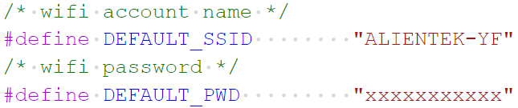
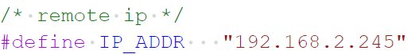
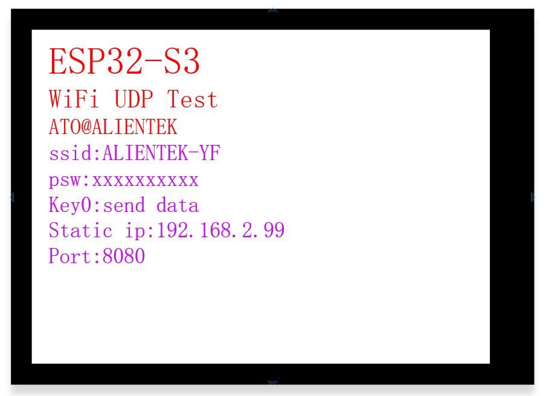
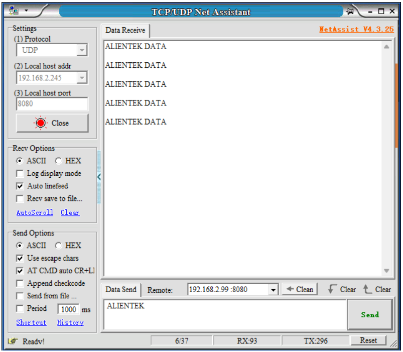

## wifi udp example

### 1 Brief

Learn about the UDP protocol.

### 2 Hardware Hookup

The hardware resources used in this experiment are:

- LED - IO1

- LCD - ALIENTEK 1.3 or 2.4 inch screen
  - CS - IO21
  - SCK - IO12
  - SDA - IO11
  - DC - IO40(jumper cap connection)
  - PWR - XL9555_P13
  - RST - XL9555_P12

- XL9555
  - IIC_SCL - IO42
  - IIC_SDA - IO41
  - IIC_INT - IO0(jumper cap connection)

The WiFi is an internal peripheral, so there is no corresponding connection schematic diagram.

### 3 Running

#### 3.1 Compilation and Download

There are two ways to download code for ESP32S3.

##### 3.1.1 USB UART

.png)

**1 Compilation process**

- Connect the USB UART on the DNESP32S3 development board to your computer using a USB data cable
- Open the '05_WiFi_UDP' example using VS Code
- Select UART port number (Figure ①:ESP-IDF: Select Port to Use (COM, tty, usbserial))
- Set Engineering Target Chip (Figure ②:ESP-IDF: Set Espressif Device Target)
- Clearing project engineering（Figure ③:ESP IDF: Full Clean）
- Select Flash Method (Figure ⑤:ESP-IDF: Select Flash Method)
- Build Project (Figure ④:ESP-IDF: Build Project)

**2 Download process**

- Download（Figure ⑥:ESP-IDF: Flash Device）

##### 3.1.2 JTAG(USB)

.png)

**1 Compilation process**

- Connect the USB(JTAG) on the DNESP32S3 development board to your computer using a USB data cable
- Open the '05_WiFi_UDP' example using VS Code
- Select JTAG port number (Figure ①:ESP-IDF: Select Port to Use (COM, tty, usbserial))
- Clearing project engineering（Figure ③:ESP IDF: Full Clean）
- Select Flash Method (Figure ⑤:ESP-IDF: Select Flash Method)
- Build Project (Figure ④:ESP-IDF: Build Project)

**2 Download process**

- Download（Figure ⑥:ESP-IDF: Flash Device）

#### 3.2 Phenomenon

Open the network debugging assistant, configure the connection protocol and network parameters. Once the network connection is successful, data transmission and reception can be achieved.

Note: Before connecting, the computer and the development board must be connected to the same WiFi hotspot.

1.First, open the `wifi_config.c` file in the project and configure the macros `DEFAULT_SSID` and `DEFAULT_PWD`. Among them, DEFAULT_SSID represents the account name required to connect to WiFi, while DEFAULT_PWD represents the password for that WiFi.

2.Next, open the `lwip_demo.c` file and set the `IP_ADDR` macro. This macro is used to specify which remote IP address to connect to.

3.Download the code to the DNESP32S3 development board.

4.Open the network debugging assistant, configure the connection protocol and network parameters. 

5.Open ESP-IDF monitor on Device to view received data.

