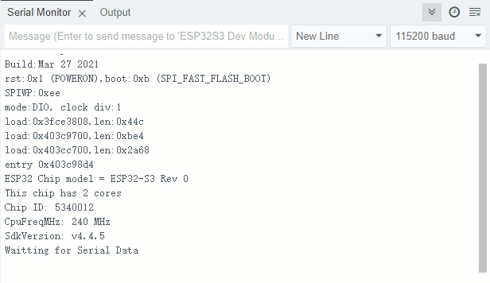

## uart example

### 1 Brief

The main function of this code is that ESP32S3 talks with the host computer through UART0, and ESP32S3 will return to the host computer after receiving the string sent by the host computer. At regular intervals, the serial port sends a message to the computer.

### 2 Hardware Hookup

The hardware resources used in this experiment are:

UART0

- TXD0 - IO43

- RXD0 - IO44

Note The pins U0_TXD and U0_RXD of the serial port are connected to the RXD and TXD pins of the serial port chip through jumper caps.

### 3 Running

#### 3.1 Compile & Download

**1 Compilation process**

- Connect the UART interface in the upper left corner of the image to the computer using a USB cable
- 04_uart routine opened using Arduino IDE2
- Select Target Board (① Arduino IDE: Tools --> Board --> esp32 --> ESP32S3 Dev Module)
- Select UART port number (② Arduino IDE: Tools --> port --> COMx)
- Set ESP32S3 parameter (③ Arduino IDE: Tools --> esp32s3 parameter(please see led example))
- Compile arduino project (④ Arduino IDE: "Sketch --> Verify/Compile" or "Ctrl+R" or "Verify button")
- Wait for compilation success (⑤ Arduino IDE: Output Window --> show "Done compiling")

**2 Download process**

- Download (⑥ Arduino IDE: "Sketch --> Upload" or "Ctrl+U" or "Upload button")

#### 3.2 Phenomenon

After normal operation, the serial port is opened, the serial port debugging Assistant displays a prompt message.

