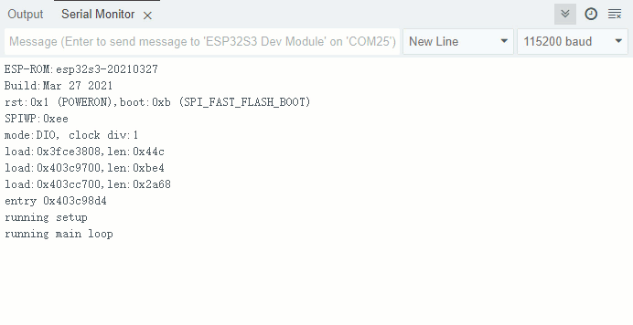

## watch dog example

### 1 Brief

The main function of this code is to  analog watchdog function.

### 2 Hardware Hookup

The hardware resources used in this experiment are:

- KEY - IO0
- UART0

	- TXD0 - IO43

	- RXD0 - IO44

The analog watchdog uses a timer peripheral, which is an internal peripheral,so there is no corresponding connection schematic diagram.

### 3 Running

#### 3.1 Compile & Download

**1 Compilation process**

- Connect the UART interface in the upper left corner of the image to the computer using a USB cable
- 06_watch_dog routine opened using Arduino IDE2
- Select Target Board (① Arduino IDE: Tools --> Board --> esp32 --> ESP32S3 Dev Module)
- Select UART port number (② Arduino IDE: Tools --> port --> COMx)
- Set ESP32S3 parameter (③ Arduino IDE: Tools --> esp32s3 parameter(please see led example))
- Compile arduino project (④ Arduino IDE: "Sketch --> Verify/Compile" or "Ctrl+R" or "Verify button")
- Wait for compilation success (⑤ Arduino IDE: Output Window --> show "Done compiling")

**2 Download process**

- Download (⑥ Arduino IDE: "Sketch --> Upload" or "Ctrl+U" or "Upload button")

#### 3.2 Phenomenon

The serial port displays the running time information. When the button is pressed, the running time becomes longer. As a result, the dog cannot be fed within 1.2 seconds, and the software is reset in the timer interrupt callback function.

