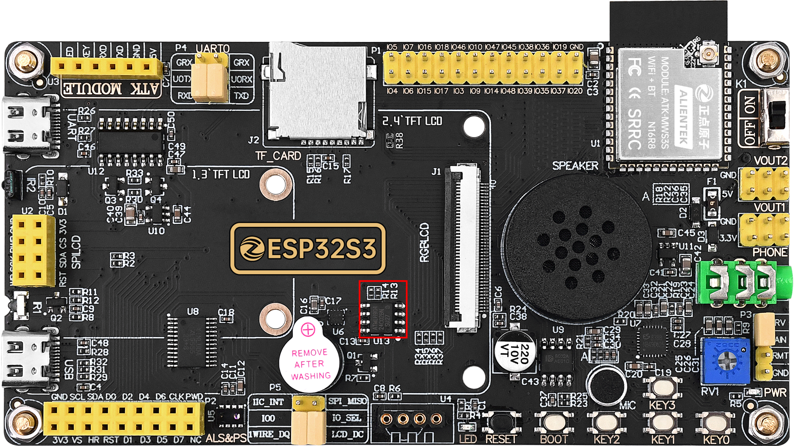
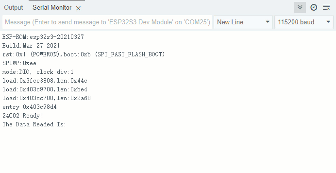

## iic eeprom example

### 1 Brief

The main function of this code is to read and write the EEPROM device.

### 2 Hardware Hookup

The hardware resources used in this experiment are:

- KEY - IO0
- UART0

	- TXD0 - IO43
	- RXD0 - IO44
- EEPROM
	- IIC_SCL - IO42
	- IIC_SDA - IO41

The position of the EEPROM in the development board is shown as follows:

### 3 Running

#### 3.1 Compile & Download

**1 Compilation process**

- Connect the UART interface in the upper left corner of the image to the computer using a USB cable
- 08_iic_eeprom routine opened using Arduino IDE2
- Select Target Board (① Arduino IDE: Tools --> Board --> esp32 --> ESP32S3 Dev Module)
- Select UART port number (② Arduino IDE: Tools --> port --> COMx)
- Set ESP32S3 parameter (③ Arduino IDE: Tools --> esp32s3 parameter(please see led example))
- Compile arduino project (④ Arduino IDE: "Sketch --> Verify/Compile" or "Ctrl+R" or "Verify button")
- Wait for compilation success (⑤ Arduino IDE: Output Window --> show "Done compiling")

**2 Download process**

- Download (⑥ Arduino IDE: "Sketch --> Upload" or "Ctrl+U" or "Upload button")

#### 3.2 Phenomenon

After normal operation, pressed BOOT key will write data to the EEPROM, and every 1 second will print out the valid content stored at the 0 address of the EEPROM.

