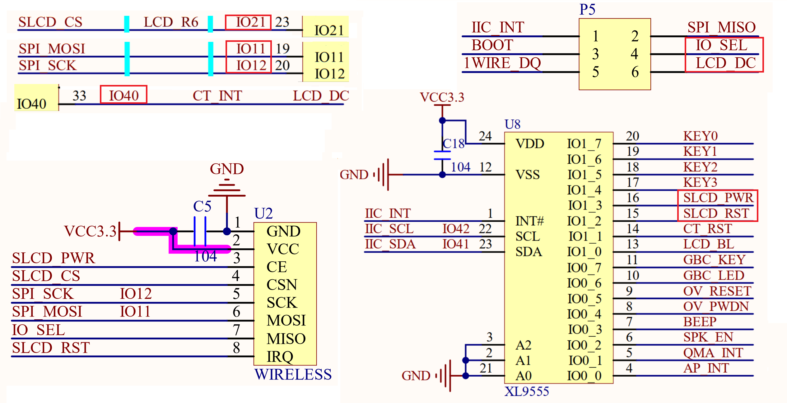
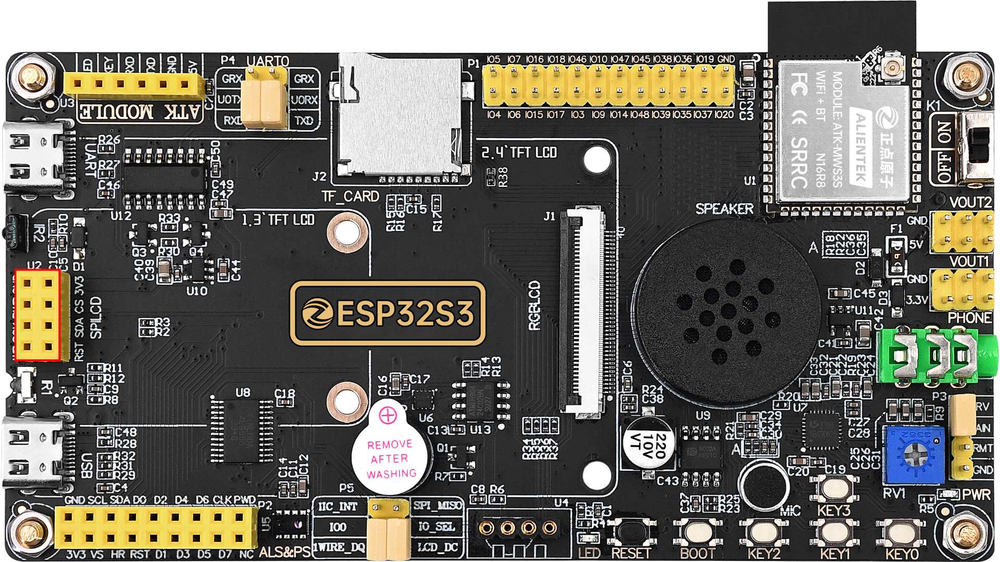
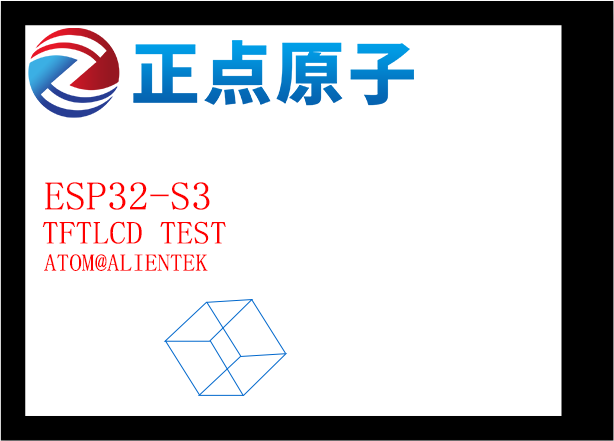

## spi_lcd example

### 1 Brief

The main function of this code is to use a 1.3 or 2.4 inch screen to display experimental information.

### 2 Hardware Hookup

The hardware resources used in this experiment are:

- UART0

	- TXD0 - IO43
	- RXD0 - IO44
- XL9555
	- IIC_SCL - IO42
	- IIC_SDA - IO41
	- IIC_INT - IO0(jumper cap connection)
- SPI_LCD
	- CS - IO21
	- SCK - IO12
	- SDA - IO11
	- DC - IO40(jumper cap connection)
	- PWR - XL9555_P13
	- RST - XL9555_P12

The place position of the SPILCD in the development board is shown as follows:

### 3 Running

#### 3.1 Compile & Download

**1 Compilation process**

- Connect the UART interface in the upper left corner of the image to the computer using a USB cable
- 11_spi_lcd routine opened using Arduino IDE2
- Select Target Board (① Arduino IDE: Tools --> Board --> esp32 --> ESP32S3 Dev Module)
- Select UART port number (② Arduino IDE: Tools --> port --> COMx)
- Set ESP32S3 parameter (③ Arduino IDE: Tools --> esp32s3 parameter(please see led example))
- Compile arduino project (④ Arduino IDE: "Sketch --> Verify/Compile" or "Ctrl+R" or "Verify button")
- Wait for compilation success (⑤ Arduino IDE: Output Window --> show "Done compiling")

**2 Download process**

- Download (⑥ Arduino IDE: "Sketch --> Upload" or "Ctrl+U" or "Upload button")

#### 3.2 Phenomenon

After normal operation, the spilcd module will display experimental demo.

