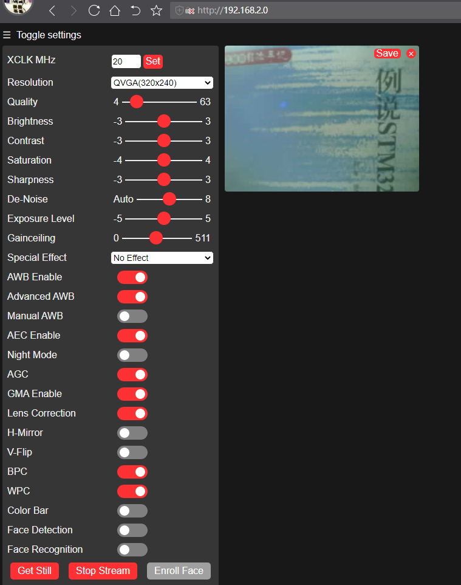

## wifi_webserver example

### 1 Brief

The main function of this code is to learn how to use webcamera.

### 2 Hardware Hookup

The hardware resources used in this experiment are:

- LED - IO1
- UART0
	- TXD0 - IO43
	- RXD0 - IO44
- XL9555
	- IIC_SCL - IO42
	- IIC_SDA - IO41
	- IIC_INT - IO0(jumper cap connection)
- SPI_LCD
	- CS - IO21
	- SCK - IO12
	- SDA - IO11
	- DC - IO40(jumper cap connection)
	- PWR - XL9555_P13
	- RST - XL9555_P12
- CAMERA
	- OV_D0 - IO4
	- OV_D1 - IO5
	- OV_D2 - IO6
	- OV_D3 - IO7
    - OV_D4 - IO15
    - OV_D5 - IO16
    - OV_D6 - IO17
    - OV_D7 - IO18
    - OV_VSYNC - IO47
    - OV_HREF - IO48
    - OV_PCLK - IO45
    - OV_SCL - IO38
    - OV_SDA - IO39
    - OV_PWDN - XL9555_P4
    - OV_RESET - XL9555_P5

The WiFi is an internal peripheral, so there is no corresponding connection schematic diagram.

### 3 Running

#### 3.1 Compile & Download

**1 Compilation process**

- Connect the UART interface in the upper left corner of the image to the computer using a USB cable
- 06_camera_webserver routine opened using Arduino IDE2
- Select Target Board (① Arduino IDE: Tools --> Board --> esp32 --> ESP32S3 Dev Module)
- Select UART port number (② Arduino IDE: Tools --> port --> COMx)
- Set ESP32S3 parameter (③ Arduino IDE: Tools --> esp32s3 parameter(please see led example))
- Compile arduino project (④ Arduino IDE: "Sketch --> Verify/Compile" or "Ctrl+R" or "Verify button")
- Wait for compilation success (⑤ Arduino IDE: Output Window --> show "Done compiling")

**2 Download process**

- Download (⑥ Arduino IDE: "Sketch --> Upload" or "Ctrl+U" or "Upload button")

#### 3.2 Phenomenon

After normal operation, get the IP of ESP32S3, connect through the web page, you can see the real-time image data of the camera.

Note:the wifi connected to computer must be **in the same frequency band** as the wifi connected to the ESP32S3 (server)

The wifi connection is successful, and the camera is ready for web access

On the web side, access 192.168.2.0 to access the webcamera page

