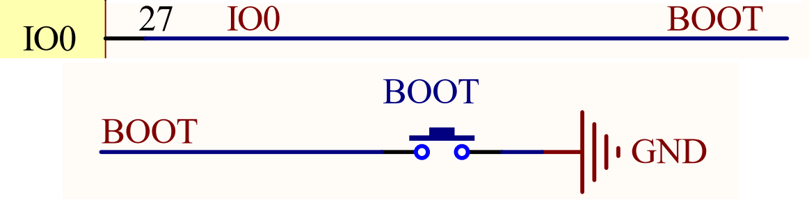

## key example

### 1 Brief

The main function of this code is to control the LED through the onboard KEY BOOT key.

### 2 Hardware Hookup

The hardware resources used in this experiment are:

- LED - IO1
- KEY - IO0

The position of the KEY in the development board is shown as follows:

### 3 Running

#### 3.1 Download

If you need to download the code, please refer to the 3.3 Running Offline section in the [Developing With MicroPython tutorial](../../../../1_docs/Developing_With_MicroPython.md), which provides a detailed download process.

#### 3.2 Phenomenon

After normal operation, press the BOOT key to turn on the red LED.Otherwise, the red LED is off.