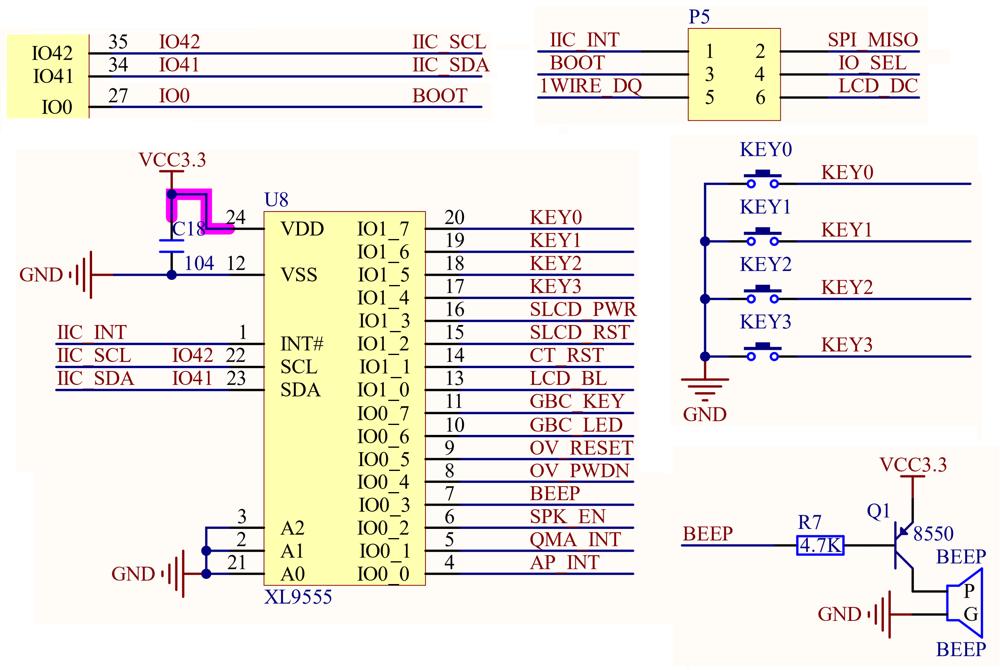

## iic_exio example

### 1 Brief

The main function of this code is to let the onboard LED blink alternately at a frequency of 500 milliseconds.

### 2 Hardware Hookup

The hardware resources used in this experiment are:

- LED - IO1
- XL9555
  - IIC_SCL - IO42
  - IIC_SDA - IO41
  - IIC_INT - IO0(jumper cap connection)

The position of the XL9555 in the development board is shown as follows:

### 3 Running

#### 3.1 Download

If you need to download the code, please refer to the 3.3 Running Offline section in the [Developing With MicroPython tutorial](../../../../1_docs/Developing_With_MicroPython.md), which provides a detailed download process.

#### 3.2 Phenomenon

After normal operation, press KEY0 and KEY1 on the development board to control buzzer work, press KEY2 and KEY3 to control LED light off.
