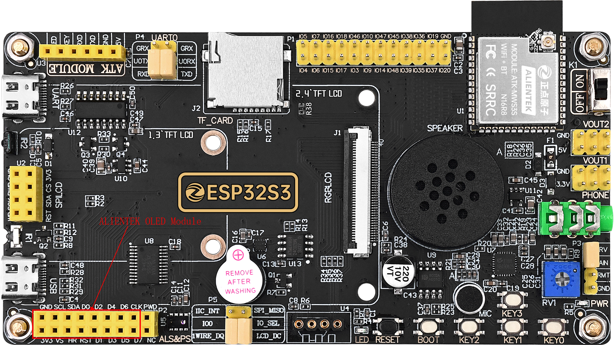

## iic_oled example

### 1 Brief

The main function of this code is to use a oled module to display experimental information.

### 2 Hardware Hookup

The hardware resources used in this experiment are:

- XL9555
  - IIC_SCL - IO42
  - IIC_SDA - IO41
- OLED
  - D0(SCL) - IO40
  - D1(SDA) - IO41
  - D2 - IO6
  - DC - IO38

The place position of the OLED module in the development board is shown as follows:

### 3 Running

#### 3.1 Download

If you need to download the code, please refer to the 3.3 Running Offline section in the [Developing With MicroPython tutorial](../../../../1_docs/Developing_With_MicroPython.md), which provides a detailed download process.

#### 3.2 Phenomenon

After normal operation, the oled module will display experimental demo.
