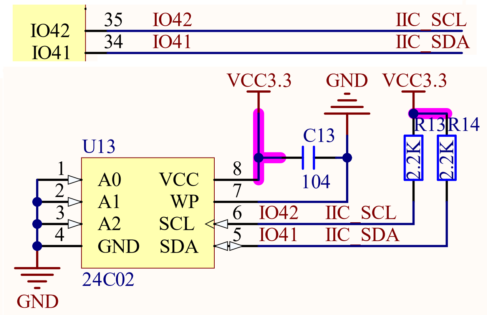
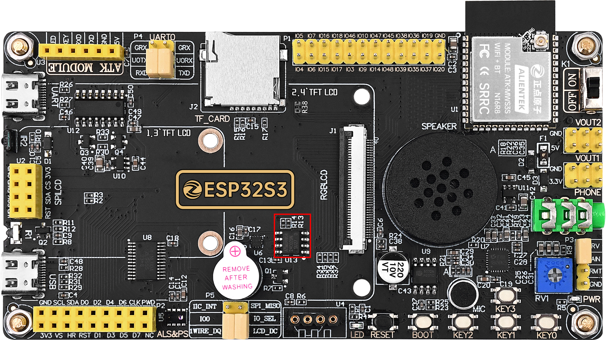

## iic eeprom example

### 1 Brief

The main function of this code is to read and write the EEPROM device.

### 2 Hardware Hookup

The hardware resources used in this experiment are:

- KEY - IO0
- UART0

  - TXD0 - IO43
  - RXD0 - IO44
- EEPROM
  - IIC_SCL - IO42
  - IIC_SDA - IO41

The position of the EEPROM in the development board is shown as follows:

### 3 Running

#### 3.1 Download

If you need to download the code, please refer to the 3.3 Running Offline section in the [Developing With MicroPython tutorial](../../../../1_docs/Developing_With_MicroPython.md), which provides a detailed download process.

#### 3.2 Phenomenon

