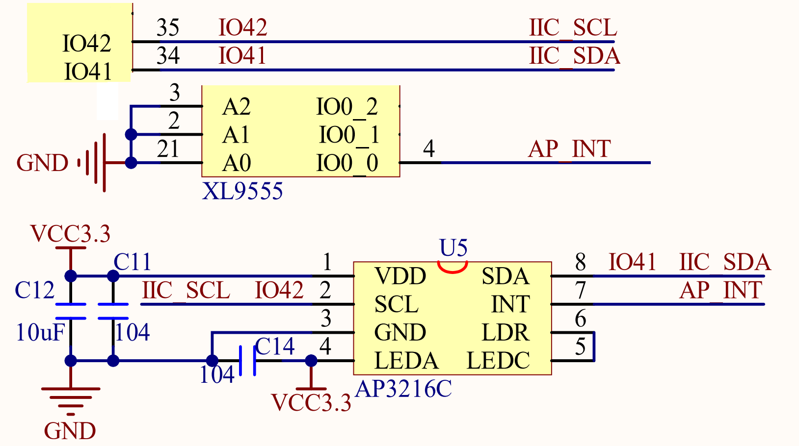
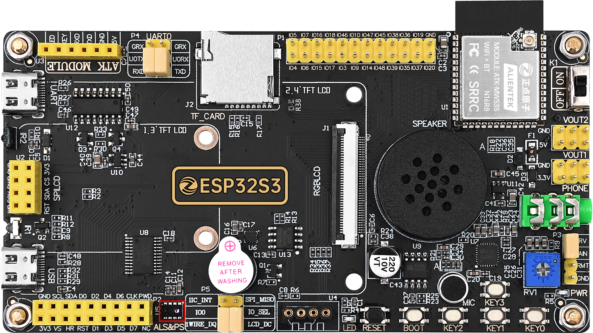

## iic_ap3216c example

### 1 Brief

The main function of this code is to learn how to use the light environment sensor AP3216C to measure light intensity (ALS)/ proximity distance (PS)/ infrared intensity (IR), etc.

### 2 Hardware Hookup

The hardware resources used in this experiment are:

- UART0

  - TXD0 - IO43
  - RXD0 - IO44
- XL9555
  - IIC_SCL - IO42
  - IIC_SDA - IO41
  - IIC_INT - IO0(jumper cap connection)
- SPI_LCD
  - CS - IO21
  - SCK - IO12
  - SDA - IO11
  - DC - IO40(jumper cap connection)
  - PWR - XL9555_P13
  - RST - XL9555_P12
- AP3216C
  - SCK - IO40
  - SDA - IO41
  - INT - XL9555_P00

The position of the ap3216c in the development board is shown as follows:

### 3 Running

#### 3.1 Download

If you need to download the code, please refer to the 3.3 Running Offline section in the [Developing With MicroPython tutorial](../../../../1_docs/Developing_With_MicroPython.md), which provides a detailed download process.

#### 3.2 Phenomenon

After normal operation, the LCD displays the ALS+PS+IR data of the optical environment sensor.

