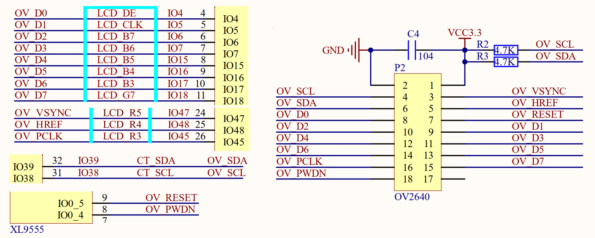
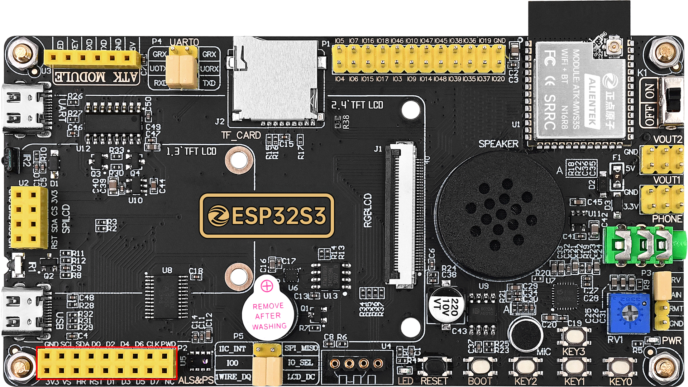

## camera example

### 1 Brief

The main function of this code is to learn the camera module.

### 2 Hardware Hookup

The hardware resources used in this experiment are:

- LED - IO1
- UART0
  - TXD0 - IO43
  - RXD0 - IO44
- XL9555
  - IIC_SCL - IO42
  - IIC_SDA - IO41
  - IIC_INT - IO0(jumper cap connection)
- SPI_LCD
  - CS - IO21
  - SCK - IO12
  - SDA - IO11
  - DC - IO40(jumper cap connection)
  - PWR - XL9555_P13
  - RST - XL9555_P12
- CAMERA
  - OV_D0 - IO4
  - OV_D1 - IO5
  - OV_D2 - IO6
  - OV_D3 - IO7
  - OV_D4 - IO15
  - OV_D5 - IO16
  - OV_D6 - IO17
  - OV_D7 - IO18
  - OV_VSYNC - IO47
  - OV_HREF - IO48
  - OV_PCLK - IO45
  - OV_SCL - IO38
  - OV_SDA - IO39
  - OV_PWDN - XL9555_P4
  - OV_RESET - XL9555_P5

The place position of the camera module in the development board is shown as follows:

### 3 Running

#### 3.1 Download

If you need to download the code, please refer to the 3.3 Running Offline section in the [Developing With MicroPython tutorial](../../../../1_docs/Developing_With_MicroPython.md), which provides a detailed download process.

#### 3.2 Phenomenon

After normal operation, the LCD displays what the camera is shooting.

