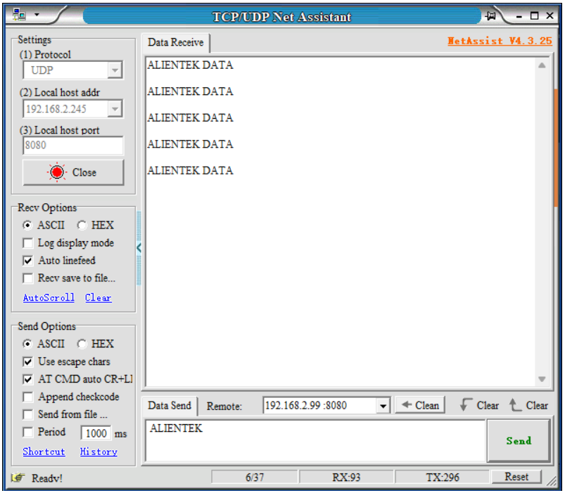

## wifi udp example

### 1 Brief

Learn about the UDP protocol.

### 2 Hardware Hookup

The hardware resources used in this experiment are:

- LED - IO1

The WiFi is an internal peripheral, so there is no corresponding connection schematic diagram.

### 3 Running

#### 3.1 Download

If you need to download the code, please refer to the 3.3 Running Offline section in the [Developing With MicroPython tutorial](../../../../1_docs/Developing_With_MicroPython.md), which provides a detailed download process.

#### 3.2 Phenomenon

Note: Before connecting, the computer and the development board must be connected to the same WiFi hotspot.

1.To configure the WiFi network credentials and remote IP address.

2.Download the code to the DNESP32S3 development board.

3.Open the network debugging assistant, configure the connection protocol and network parameters. 

4.Open ESP-IDF monitor on Device to view received data.