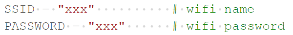
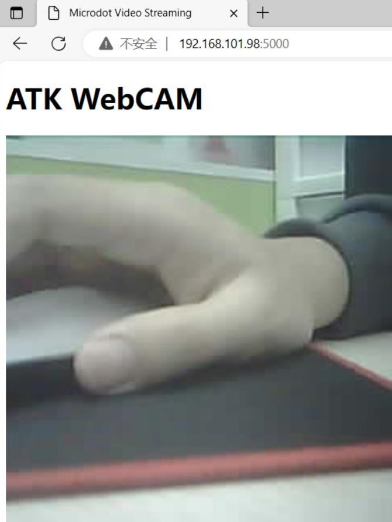

## WebCAM example

### 1 Brief

To display camera images on a webpage.

### 2 Hardware Hookup

The hardware resources used in this experiment are:

- LED - IO1
- XL9555
  - IIC_SCL - IO42
  - IIC_SDA - IO41
  - IIC_INT - IO0(jumper cap connection)
- CAMERA
  - OV_D0 - IO4
  - OV_D1 - IO5
  - OV_D2 - IO6
  - OV_D3 - IO7
  - OV_D4 - IO15
  - OV_D5 - IO16
  - OV_D6 - IO17
  - OV_D7 - IO18
  - OV_VSYNC - IO47
  - OV_HREF - IO48
  - OV_PCLK - IO45
  - OV_SCL - IO38
  - OV_SDA - IO39
  - OV_PWDN - XL9555_P4
  - OV_RESET - XL9555_P5

The WiFi is an internal peripheral, so there is no corresponding connection schematic diagram.

### 3 Running

#### 3.1 Download

If you need to download the code, please refer to the 3.3 Running Offline section in the [Developing With MicroPython tutorial](../../../../1_docs/Developing_With_MicroPython.md), which provides a detailed download process.

#### 3.2 Phenomenon

To display camera images on a webpage.

Note: Before connecting, the computer and the development board must be connected to the same WiFi hotspot.

1.To configure the WiFi network credentials.

2.Download the code to the DNESP32S3 development board.

3.Open the browser and enter the IP address followed by the port number.

