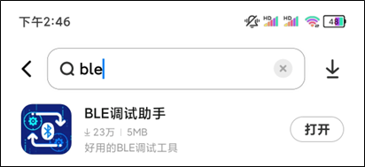
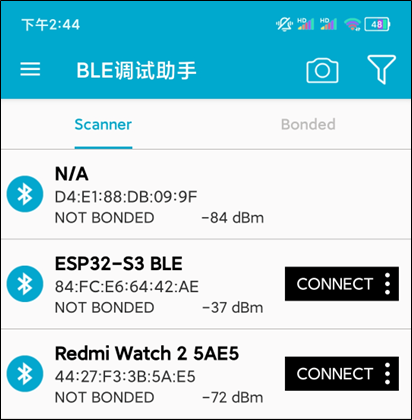
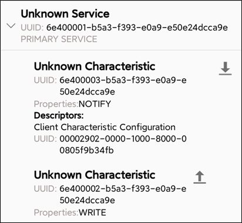
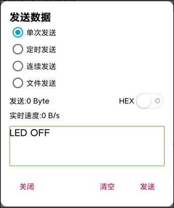

## wifi tcpclient example

### 1 Brief

Learning Bluetooth control.

### 2 Hardware Hookup

The hardware resources used in this experiment are:

- LED - IO1

The BLE is an internal peripheral, so there is no corresponding connection schematic diagram.

### 3 Running

#### 3.1 Download

If you need to download the code, please refer to the 3.3 Running Offline section in the [Developing With MicroPython tutorial](../../../../1_docs/Developing_With_MicroPython.md), which provides a detailed download process.

#### 3.2 Phenomenon

1."Download a BLE debugging assistant from the app store on your phone.

2.Open the BLE debugging assistant, go to the Scanner interface, and refresh the screen (search for Bluetooth devices). Next, find the 'ESP32-S3 BLE' Bluetooth device, and click 'CONNECT' to connect to the device.

3.After successful connection, click on the 'Unknown Characteristic' option under the 'Unknown Service' section to send data to the ESP32-S3 development board.

4.Click on the upward arrow in the image above, select the data transmission mode and message content. If we send the message 'LED ON', the LED on the development board will light up. If we send the message 'LED OFF', the LED on the development board will turn off.

