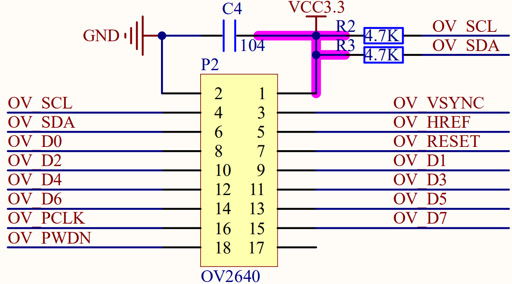

## face recognition example

### 1 Brief

The main function of this code is to recognition faces.

### 2 Hardware Hookup

The hardware resources used in this experiment are:

- LED - IO1

- LCD - ALIENTEK 1.3 or 2.4 inch screen
  - CS - IO21
  - SCK - IO12
  - SDA - IO11
  - DC - IO40(jumper cap connection)
  - PWR - XL9555_P13
  - RST - XL9555_P12

- XL9555
  - IIC_SCL - IO42
  - IIC_SDA - IO41
  - IIC_INT - IO0(jumper cap connection)

- CAMERA
  - OV_D0 - IO4
  - OV_D1 - IO5
  - OV_D2 - IO6
  - OV_D3 - IO7
  - OV_D4 - IO15
  - OV_D5 - IO16
  - OV_D6 - IO17
  - OV_D7 - IO18
  - OV_VSYNC - IO47
  - OV_HREF - IO48
  - OV_PCLK - IO45
  - OV_SCL - IO38
  - OV_SDA - IO39
  - OV_PWDN - XL9555_P4
  - OV_RESET - XL9555_P5

The position of the CAMERA in the development board is shown as follows:

### 3 Running

#### 3.1 Download

If you need to download the code, please refer to the 3.3 Running Offline section in the [Developing With MicroPython tutorial](../../../../1_docs/Developing_With_MicroPython.md), which provides a detailed download process.

#### 3.2 Phenomenon

1.When the camera captures a face and autofocus, the system will quickly perform face detection. Once a frontal face is detected, the system will integrate the image data with the detection results to form new image data, which will be immediately displayed on the LCD screen.

2.If you need to input new facial information, long press the BOOT button to save it to the fr partition.

3.To recognize the current face, simply press the BOOT button and the system will immediately perform the recognition operation.

4.If you need to delete the currently entered facial data, double-click the BOOT button to achieve it.

5.The flashing status of LED lights will reflect the real-time running status of the program.

