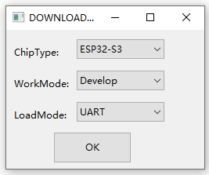
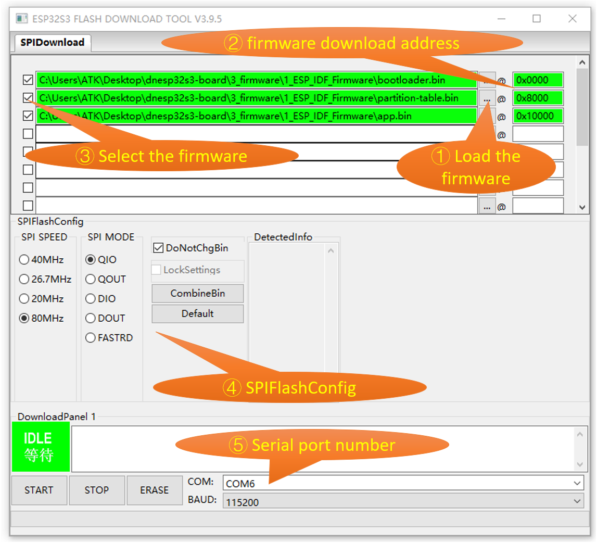
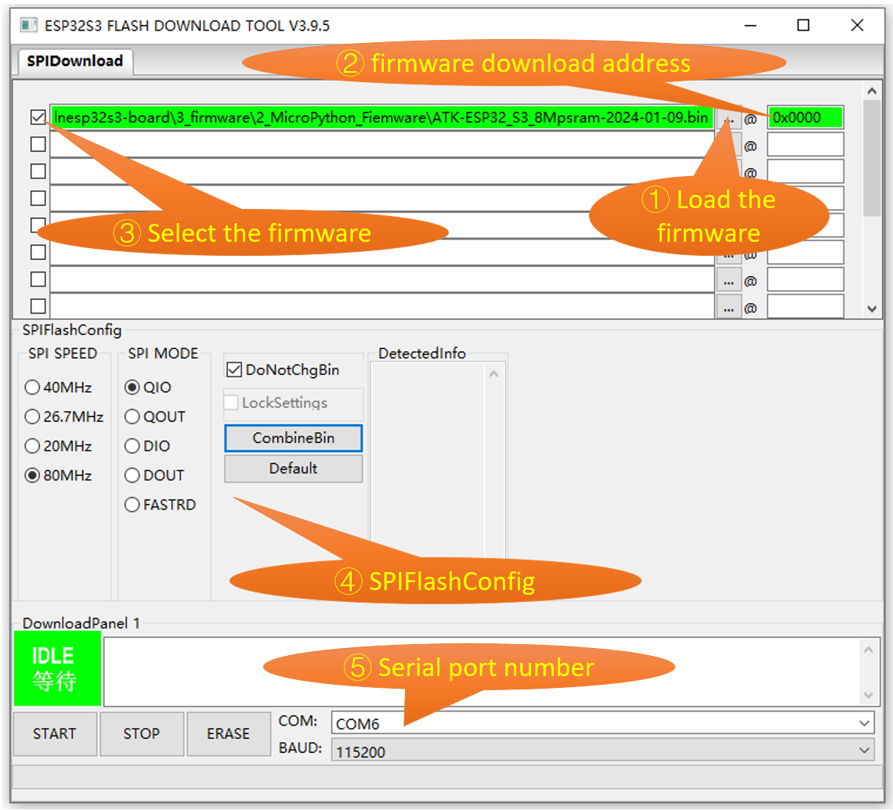
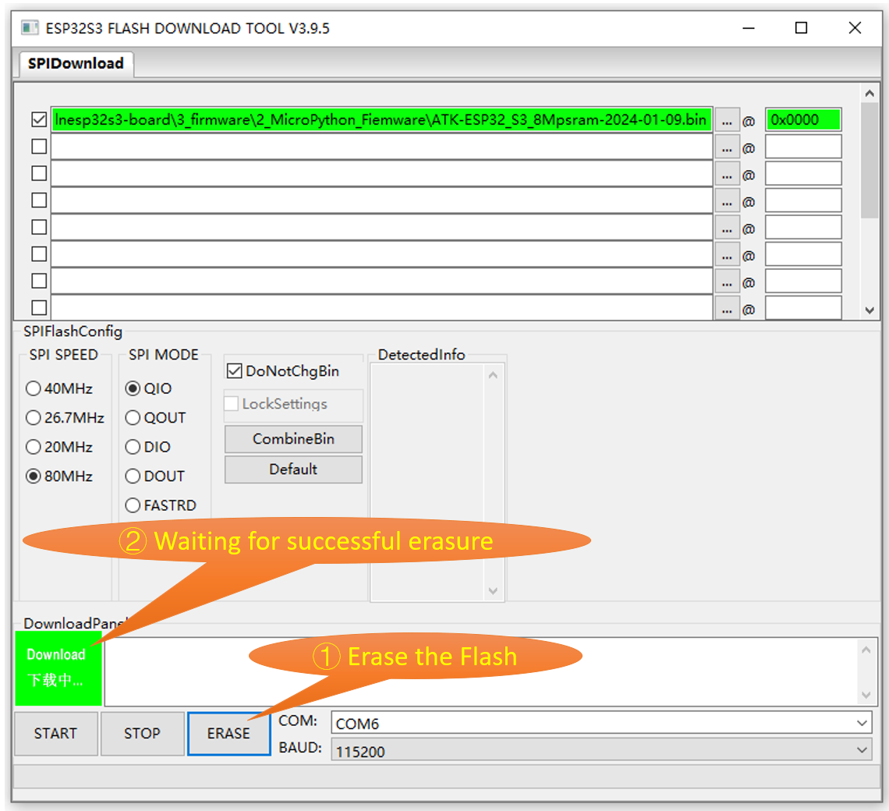
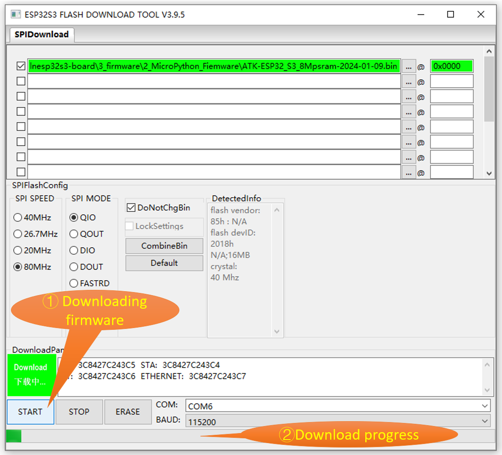

# Firmware Repository

This repository contains two folders: `1_ESP_IDF_Firmware` and `2_MicroPython_Firmware`.

## 1_ESP_IDF_Firmware

The 1_ESP_IDF_Firmware folder is specifically dedicated to storing comprehensive example firmware for the DNESP32S3 development board meticulously designed by ALIENTEK company. Before downloading this firmware, please ensure that you have the ALIENTEK 2.4-inch SPI LCD screen and SD card accessories. It is worth noting that all files located in the ./2_examples\4_SD_card_root_directory_file directory will be stored on the SD card, ensuring smooth access to the required content during usage.

## 2_MicroPython_Firmware

The 2_MicroPython_Firmware folder contains two MicroPython firmware provided by ALIENTEK company. The ATK-ESP32_S3_8Mpsram(with_AI)-2024-01-09.bin firmware includes AI interfaces, while the ATK-ESP32_S3_8Mpsram-2024-01-09.bin firmware does not include AI interfaces.

---

## Firmware Download

1.Open the "./4_tools/flash_download_tool_3.9.6_0" folder, and double-click on "flash_download_tool_3.9.5.exe" to launch the ESP32S3 Flash Download Tool.

2.Select the chip type, operating mode, and download method.

3.Load the downloaded firmware.

4.Select the serial port number (COM) and download baud rate.

**Configuration method for firmware stored in the 1_ESP_IDF_Firmware folder.**

**Configuration method for firmware stored in the 2_MicroPython_Firmware folder.**

5.Press the "ERASE" button to erase the Flash.

6.Press the "START" button to download the firmware to the ESP32S3 module.

